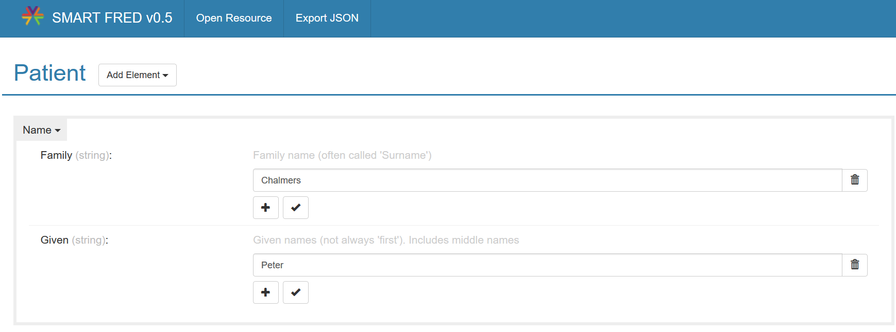
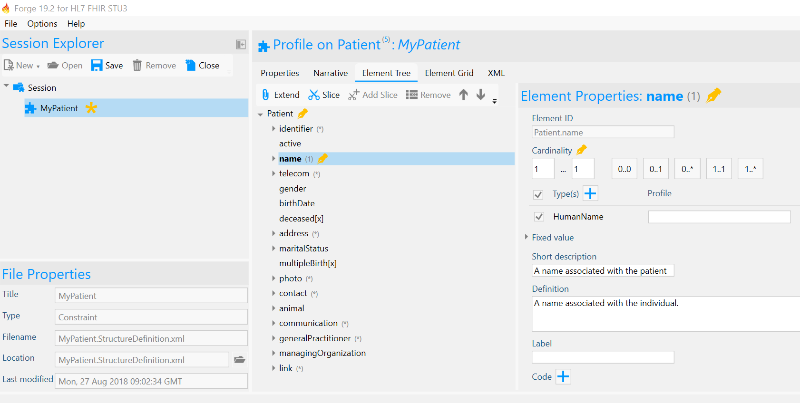
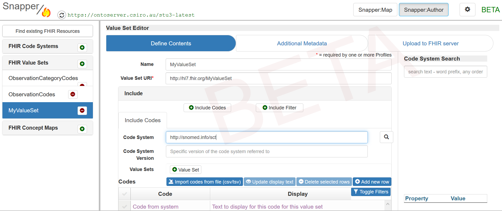
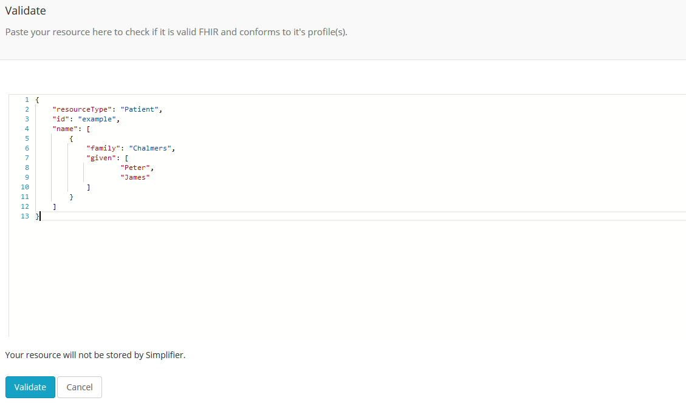
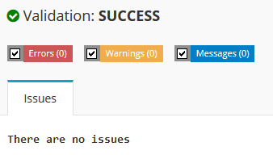
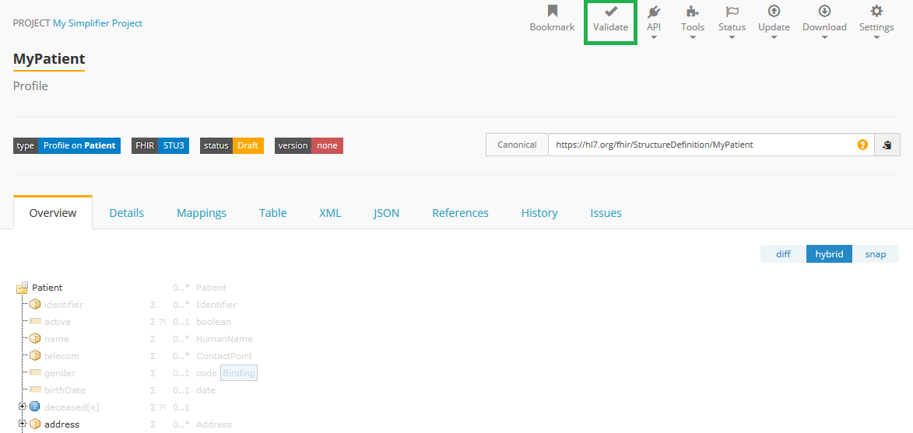

Create my first resource
===========================

Congratulations! You are now officialy becoming a real FHIR geek. Welcome to the club! On this page we will explain how you can create FHIR resources. First, we will explain the different kinds of resources that are known to FHIR. Next, we will explain which tools come in handy when creating a FHIR resource and how to use them. Finally, we will take you through the process of creating, validating and publishing your very first FHIR resource.

FHIR resources 
--------------
FHIR resources are the building blocks of FHIR. Clinical concepts, terminology, operations, conformance... everything in FHIR is stored in a resource. FHIR resources are classified into 6 categories:

- Foundation: Resources used for internal FHIR requirements and to manage specification, development and testing of FHIR solutions (e.g. CapabilityStatement, StructureDefinition)
- Base: Supporting entities involved in and workflow to manage healthcare process (e.g. Patient, Encounter, Appointment)
- Clinical: The content of a clinical record (e.g. Observation, Procedure, Medication)
- Financial: Resources that support the billing and payment parts of FHIR (e.g. Claim, Coverage)
- Specialized: Specialized resources to support research, clinical decision support, quality reporting and testing (e.g. Questionnaire, Measure, Testscript)

A full list of FHIR resources can be found in the `HL7 FHIR specification <https://www.hl7.org/fhir/resourcelist.html>`_.

Profiling
---------
FHIR resources can be used in a flexible way. The definition of a resource describes its elements and how these should be used. For example, a Patient resource has the elements name and gender. An instance of this resource is allowed to have one or more name elements, but only one gender element. The value of the gender element is restricted to male, female, other or unknown. All these rules are captured in the resource definition, which in itself is stored in a StructureDefinition resource. The StructureDefinition resource is a special kind of resource that can be used to customize resources for your own implementation. For example, you could create a MyPatient StructureDefinition resource based on the Patient resource. You can add constraints to your MyPatient resource, such as making its gender mandatory or only allow one name element. This customization process is called Profiling. Your MyPatient resource is called a Profile on the Patient resource. It is a customized definition of the Patient resource, stored in another instance of the StructureDefinition resource. Note that you can only add constraints in your Profile, you cannot remove constraints from the original resource.  

How to create resources
-----------------------
There are several ways to create resource instances: handcode them or use a tool with an interactive user-interface. The following (free) tools support the creation of FHIR resources:
- SMART FRED: An intuitive online tool that allows you to create resource instances (examples).
- Forge: A user-friendly profile editor that offers a convenient way to create StructureDefinitions (e.g. profiles and extensions) and logical models.
- ClinFHIR: An online tool with multiple helpful modules. The Scenario Builder allows you to create clinical scenarios and resource instances. With the Logical Modeller you can create LogicalModels and generate StructureDefinitions (profiles) based on these models. In addition, there are modules to build extensions, CodeSystems and ValueSets.
- Snapper: An online tool that comes in handy to build your terminology resources (e.g.ValueSets and CodeSystems)

In the next sections, we will explain how to use these tools to create resources. We will also explain how you can handcode them in XML or JSON.

SMART FRED
^^^^^^^^^^
Visit `SMART FRED <http://docs.smarthealthit.org/fred/>`_. and click ``Open Resource``. By default the ``Paste JSON`` box contains the following code: ``{"resourceType": "Patient"}``. Change the resource type to the resource type you want to add. For example, if you want to add a Procedure, the box should say ``{"resourceType": "Procedure"}``. Click ``Load JSON`` to open the resource. Now you can start creating your resource. Just click ``Add element`` and select the element you want to add, let's say you want to add a Subject. The element is added to your resource. Open the drop down menu to select a sub element. Choose Reference in this case. Now an input field appears. Here you can add a reference, for example type: "Patient/example" and click enter. When you are finished adding elements to your resource, click ``Export JSON``. You may either download the JSON file or copy it to your clipboard. Note that if you need XML code there are several ways to convert XML to JSON. One of them is to upload your resource to Simplifier and download a XML version.

Forge
^^^^^
`Download Forge <https://simplifier.net/forge/download>`_. (it's free!) and run it on your desktop. Click ``New Profile`` to create a new StructureDefinition. Select the name of the resource you want to profile, e.g. Patient. By default resource profiles are selected, but you can also choose to profile data types or create extensions, derived profiles and logical models. In the next step, you can edit the name, canonical URL (should be unique) and file name. Click ``OK``. By default your profile will open on the ``Element Tree`` tab. Select an element to profile it, for example you may want to select multipleBirth and change the data type to boolean (to do so deselect the tick box in front of dateTime, note that you can also deselect all types at one by deselecting the tick box in front of Type(s) on top). You can also change the cardinality of the element, for example click on ``1..1`` to make this element mandatory. To add a slice or an extension, click ``Extend`` or ``Slice`` at the top of the element tree. To learn more about how to use Forge, visit the `Forge documentation page <http://docs.simplifier.net/forge>`_. Or visit the `Profiling Academy <https://simplifier.net/guide/profilingacademy>`_. to learn all the ins and outs of profiling.

ClinFHIR
^^^^^^^^
Visit `ClinFHIR <http://clinfhir.com/>`_. and select one of the following modules:

1. Scenario Builder - Choose this option to build a clinical scenario. Click ``New Scenario`` to add a new scenario. Click ``Add Resource`` to add a resource. Select a core resource type or search for an existing profile. Your resource will be added to the list in the ``List`` tab. Depending on your choice, you will see the element tree of a selected resource based on the core resource or the selected profile. Click on an element and its data type to add data. For a visual view of the resources in your scenario and their relations, open the ``Graph`` tab.
2. Logical Modeller - You can use this module to create LogicalModels and StructureDefinitions (profiles). Choose ``New Model`` to create a new LogicalModel. You can either start with a blank model or copy all elements from a base resource. Click ``Add Element`` to add elements to your tree model or select an element and click ``Edit Element`` to edit them. Go to the ``Export`` tab and choose ``Generate Profile`` to generate a profile based on your LogicalModel. Note that this only makes sense when it conforms to the rules of a base resource.
3. Extension Definition Builder - Extensions are a special kind of StructureDefinition that can be used to extend your profile with additional elements that are not part of the base resource. Open the Extension Definition Builder to create extensions. Select ``New Extension Definition`` and provide the name, URL and cardinality of your extension. Choose ``Add element`` to add one or more elements to your extension.
4. CodeSystem Builder - Open this module to create CodeSystems. Select ``New``, provide a name and click ``Save``. Add codes to your CodeSystem resource and click ``Save``.

Each module contains JSON tabs with the JSON code of your resource(s). The homepage of ClinFHIR contains several links to documentation and videos.

Snapper
^^^^^^^
Visit `Snapper <http://ontoserver.csiro.au/snapper2-dev>`_. to create terminology resources, e.g. ValueSets, ConceptMaps and CodeSystems. The next videos explain `how to create a CodeSystem <https://www.youtube.com/watch?feature=youtu.be&v=5VIqqiQ1UUU>`_. and `how to create a ValueSet <https://www.youtube.com/watch?feature=youtu.be&v=hVU9cskxo1Q>`_. using Snapper.

XML and JSON
^^^^^^^^^^^^
The easiest way to create resources in XML or JSON is to use an editor like oXygen XML Developer. But of course you may also use NotePad++ or write your XML code directly in Simplifier (from your project select ``Upload`` and choose ``Copy/Paste``). When using an editor it is convenient to associate FHIR schemas for direct validation. These schemas can be downloaded from the `HL7 FHIR downloads page <https://www.hl7.org/fhir/downloads.html>`_. 

XML uses tags to represent information. A FHIR resource in XML starts with a tag identifying the type of resource, e.g. ``<Patient>``. Next, tags can be added following the element tree of the resource. When the cardinality of an element is more than one, you can add multiple tags for the same element. Each tag should also be closed. One option is to use a closing tag, e.g. ``</Patient>``. Another option is to close the tag directly by ending it with ``/>``. This is often done in tags that contain attributes, like ``<id value="example" />``. Here below is a simple example of a Patient resource in XML.

.. code-block:: XML

  <Patient>
    <id value="example" />
    <name>
        <family value="Chalmers"/>
        <given value="Peter"/>
        <given value="James"/>
    </name>
  </Patient>

In JSON you will also follow the element tree of your resource, but instead of tags, you will need to use brackets to group information. All child elements of an element, as well as the entire resource body, are grouped by ``{}`` and separated by ``,``. The values of elements with cardinality more than one are grouped by ``[]`` and separated by ``,``. Both elements and their values are given within ``""``. Below is the code of the same Patient resource in JSON.

.. code-block:: JSON

{
    "resourceType": "Patient",
    "id": "example",
    "name": [
        {
            "family": "Chalmers",
            "given": [
                    "Peter",
                    "James"
            ]
        }
    ]
}

How to validate resources
-------------------------
Now you have created your first resource(s), it's time to validate! 

A quick way to validate your resource is to visit https://simplifier.net/validate and copy-paste your XML or JSON code. 

All you have to do is click ``Validate`` and the integrated FHIR .NET validator will do the rest. 

You can also run the validator from a published resource in a Simplifier project. 

Another way to validate your resource is to post it on a FHIR server that supports validation. Depending on the server and the settings, an incoming resource will be validated against its base profile. If this is not the case, the server may support the ``$validate`` operation. An example of how to use this operation is given below:

.. code-block:: JSON

POST [server-endpoint]/Patient/$validate?profile=[myProfile]

When handcoding your resource, it is also helpful to download the XML and JSON schemes. Note however that you will still need to run a proper validation. 

How to publish resources
------------------------
Now you have finished your resource(s), it's time to share them. It's good practice to create an Implementation Guide for developers implementing your use case. We also encourage you to share your resources with the rest of the community. In this way others can (re)use your work for their own project(s). They may even help you out by providing feedback on your resource(s). 

`Simplifier <https://simplifier.net>`_. is a collaboration platform and a registry for all FHIR resources. It is commonly known in the FHIR community as the place to publish your FHIR resources. 

Follow the next steps to publish your resource(s) to Simplifier:

1. Log in to Simplifier. New to Simplifier? `Register for a free Simplifier account <https://simplifier.net/signup>`_.
2. Create a project (click on your avatar and select ``Portal`` to go to your personal portal, next click ``Create`` in the ``Projects`` tab)
3. Go to your project
4. Select ``Upload`` and choose one of the following options:

    a. Upload file - select the resource from a file stored on your computer or select a zip file to add multiple resources at once
    b. Fetch from URL - get your resource(s) from a FHIR server (note: you can either upload a Bundle as is or split the resources in the Bundle to add multiple resources in one run)
    c. Copy/Paste - copy/paste the XML or JSON code of your resource (note: a Bundle resource will be uploaded as is and will not be splitted)

Or export your resource(s) to Simplifier from Forge:

1. Open your resource in Forge
2. Select publish to Simplifier.net (CTRL+U) from the ``File`` menu
3. Provide your Simplifier credentials and click on ``Connect``
4. Select your project from the drop down menu
5. Click ``Save`` to publish your resource to your Simplifier project

Your published resources are visible under the ``Resources`` tab of your project. 

To learn more about Simplifier visit the `Simplifier documentation page <docs.simplifier.net/simplifier>`_. Note that it is also possible to link Simplifier projects to Github projects for automatic updates and synchronization.

Congratulations, you have created and published your first resource(s)!
