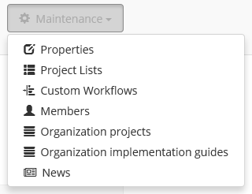
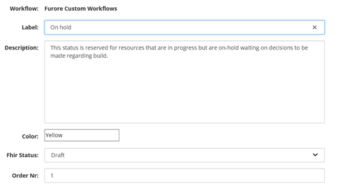

Organization Portal
^^^^^^^^^^^^^^^^^^^
For our members with a Team plan there is now additional functionality to create and manage an organizational account within Simplifier. An Organization account allows you to create and share projects, resources, and Implementation Guides via your organization with others within and outside your organization. You can add members and adjust rights to the project.  

Organization Settings
---------------------
Once you have made your account you can create and organize organizational project lists, create custom workflows, manage members, and follow your organization’s newsfeed. These settings can be accessed via the ``Maintenance`` dropdown once you are on your organization’s page.

    
 Custom Workflow
-----------------
Custom workflows allows you to create statuses for your resources that fit your needs. You can use this to communicate to your organization team, in your own language, the progress of any given resource. This is in addition to the standard FHIR workflows of “Draft”, “Active”, and “Retired”. The FHIR workflows cover the following statues:

* Draft: This resource is still under development.
* Active: This resource is ready for normal use.
* Retired: This resource has been withdrawn or superseded and should no longer be used.

To create a Custom Workflow select ``Custom Workflow`` from the ``Maintenance`` dropdown on your organization’s page. The statues that you make need to be mappable to the standard FHIR statues. If you are creating your own workflows be sure to create a workflow for each associated level of the FHIR hierarchy. This is necessary because the FHIR statues do not default into your custom list.

Organization Project Lists
--------------------------
Members with an Enterprise account have the ability to endorse others projects by creating ``Project Lists``. This list is not necessarily a list of your own projects but of interesting projects that you would like to endorse within the Simplifier community. This list, once created, will show up on your organization’s page within Simplifier. 

On the other hand your ``Organization projects`` are a compilation of the projects that are owned by the organization. This section
of your project maintenance is where you need to create and maintain organization projects. A list of these projects will also display on your organizations page.  

Newsfeed
--------
Via the ``News`` section of your project portal you can stay up to date about recent developments within the project. This can
also be used to communicate to the outside world about new developments within the project. Once you have finalized resources or finished an Implementation guide this is a great place to create an article announcing the changes. 

Issue Tracker for Projects and Resources
----------------------------------------
Would you like to capture feedback about your resources from users? The Issue tracker option is a great way to do this. If you go to the ``Options`` dropdown and then select Edit Project Properties. You will see the option to Enable Issues at the bottom of your screen. By selecting the On option, you enable the issue tracking feature of your project. There are two additional options that display once you have turned the Issue tracking on. You have the option to limit Issue visibility to project members or make them publicly visible. The issues that are reported by the community can also be limited to be viable only to your projects member or visible to the public. These issues can either be reported at a resource level or at a project level. At the project level you will see issues that are project specific and issues from all the resources in that project on the ``Issues`` tab. 

