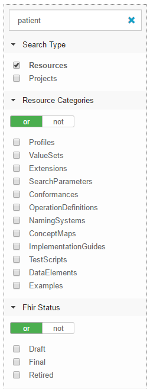

View existing FHIR resources
============================
Simplifier is a repository for FHIR resources. There are a multitude of resources that are available to the public including profiles, extensions, valuesets, dictionaries, mappings, examples and more. If these resources are listed as public then you can find them here. 

You can browse these resources easily from the Simplifier homepage or search for more specific resources if you know what you are looking for. To search for a specific resource navigate to the search box at the top of the homepage and type the term in the search field. Once you have reached the page with your search results you have options to further filter your results to include or exclude results based on certain parameters. To limit your search results to resources select ``Resources`` from the Search Type options. You can apply other filters such as Resource Categories and Fhir Status here.

Once you have found the resource you are looking for select it to see further details. Within the resource’s page you can view which project that resource is a part of, the type, status (maturity level), versioning, and  different resource views. 

While viewing resources you can display information in a few different ways.  The different views include:

* Overview – This is a Logical view of the resource which includes Element names in the leftmost column followed by Flags, Cardinality, Type, and  Description & Constraints.
* Details – This is an easy-to-read list per element of all the details of your profile. The specification refers to this as the dictionary. 
* Table – This is a simple table view of the resource.
* XML & JSON – Respective views of resources in either XML or JSON formatting. 
* History – On this tab you can view the difference between two versions of the same profile. This is a great feature for comparing and tracking changes.
