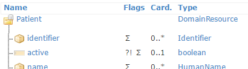
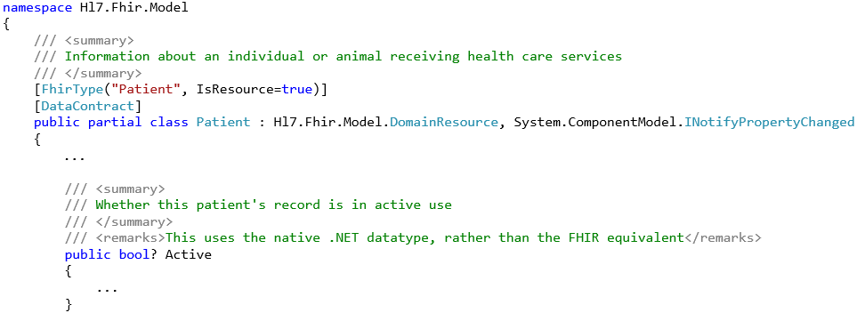

.. _FHIR-model:

======================
Working with the model
======================

``Hl7.Fhir.Model`` contains model classes which correspond to the FHIR Resources and data types,
like Patient and HumanName. The code is generated by the FHIR publication tool, which is used to
build a new version of the `FHIR website <http://www.hl7.org/fhir>`__.

In this section we will explain how to work with the model, and give you some code examples.

Partial classes for Resource and data types
-------------------------------------------
For each Resource type and data type in FHIR, the API contains a class in the form of a public partial class.
If you need extra code to be performed when using these classes, you can just implement
your own partial class for it. That way you can keep your code separate from the API code.

Class fields
^^^^^^^^^^^^
The API classes have a field for each of the elements in the Resource or data type model.
For example, the Patient resource has an ``active`` element:

|br|
The Patient class in the API has a field called ``Active`` that corresponds with this element:
 

..
	Primitive data types
	^^^^^^^^^^^^^^^^^^^^

.. |br| raw:: html

    
