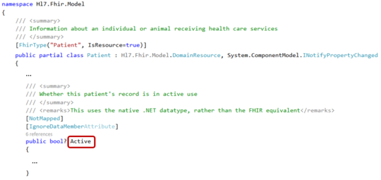

.. _FHIR-model:

======================
Working with the model
======================

``Hl7.Fhir.Model`` contains model classes which correspond to the FHIR Resources and data types,
like Patient and HumanName. The code is generated by the FHIR publication tool, which is used to
build a new version of the `FHIR website <http://www.hl7.org/fhir>`__.

In this section we will explain how to work with the model, and give you some code examples.
Add this ``using`` directive to your code:

.. code-block:: csharp

	using Hl7.Fhir.Model;

Model classes
-------------
For each Resource type and data type in FHIR, the API contains a class in the form of a public partial
class. If you need extra code to be performed when using these classes, you can just implement
your own partial class for it. That way you can keep your code separate from the API code.

Creating a new Patient resource instance, and an instance of the Identifier data type:

.. code-block:: csharp

	var pat = new Patient();
	var id = new Identifier();

Class fields
^^^^^^^^^^^^
The API classes have a field for each of the elements in the Resource or data type model.
For example, the Patient resource has an ``active`` element:

.. image:: ./images/fhir_patient_active.png

The Patient class in the API has a field called ``Active`` that corresponds with this element:
 

Likewise, the Identifier data type has an element called ``use``:

.. image:: ./images/fhir_identifier_use.png

And the Identifier class in the API has a field called ``Use`` that corresponds with this element:
 
.. image:: ./images/api_identifier_use.png

As you can see, the classes and fields all have inline documentation describing them.

Primitive data types
--------------------
In FHIR, the `data types <http://www.hl7.org/fhir/datatypes.html>`__ are divided into 'primitive'
and 'complex' data types. The primitive data types are types like ``string``, ``integer``, ``boolean``,
etc. that can take a single value. The complex types consist of multiple values grouped together.

.. important:: Primitives are not really primitive in FHIR!

Because you can `extend <http://www.hl7.org/fhir/extensibility.html>`__ resources **and** data types
in FHIR, the API has provided FHIR data types for the primitive types.
Where the name of the FHIR data type would conflict with existing .Net data types, the word 'Fhir' is
added to the type, eg. ``FhirString``. 

For each of the fields that take a primitive data type, the API provides you with two fields in the
class. |br|
One of the fields has the same name as the element it corresponds with in the FHIR resource, eg.
``Active`` in the ``Patient`` class. This field is of the standard .Net data type.

You can fill this field just the way you would expect:

.. code-block:: csharp

	var pat = new Patient();
	pat.Active = true;

The other field has got the name of the element, with 'Element' added to it, for example
``ActiveElement`` in the ``Patient`` class. You fill this field with the FHIR data type that is in
the API:

.. code-block:: csharp

	pat.ActiveElement = new FhirBoolean(true);

.. note:: Both of the statements set the same private data member of the class. 

Complex data types
------------------
Complex data types in FHIR are data types that group certain values together, such as ``Address``,
``Identifier`` and ``Quantity``. The `FHIR specification <http://www.hl7.org/fhir/datatypes.html>`__
describes which elements are part of these data types.

The API has created classes for each of the data types, with fields for each of the elements.
Most of the elements will be of a primitive data type, but you can also encounter complex types
within a complex data type.

Filling in the fields for the primitive types is explained above. If you need to fill in a field
that is of a complex data type, you will need to create an instance of that type first.

For example, if we want to fill in the data for a field of type ``Identifier``,
we can use this code:

.. code-block:: csharp

	var id = new Identifier();
	
	id.System = "http://hl7.org/fhir/sid/us-ssn";
	id.Value = "000-12-3456";

Lists
-----
For elements with a maximum cardinality > 1, the API has a list of the type for that element.

.. image:: ./images/fhir_cardinality.png
.. image:: ./images/patient_identifier.png

To work with data in a list, you can use the standard C# List methods.

So for example, adding the ``Identifier`` we created in the previous paragraph to the
``Patient.Identifier`` field of the instance of ``Patient`` we created earlier, can be
done like this:

.. code-block:: csharp

	pat.Identifier.Add(id);

.. note:: If you did not initialize the ``Patient.Identifier`` field before adding to the list,
	the API will create the List for you and will not generate a NullReferenceException.

..
	Components
	----------
	Resources can have elements with a subgroup of elements in them. These are called 'components'.
	
	
	
	
	Enumerations
	------------
	
	
	Special initializers
	--------------------
	See Initializer.cs
	
	
	Complete code example for Patient
	---------------------------------

.. |br| raw:: html

    
