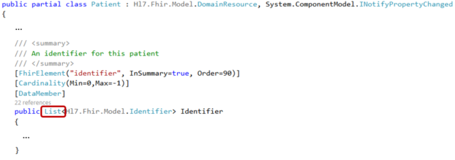

.. _FHIR-model:

======================
Working with the model
======================

``Hl7.Fhir.Model`` contains model classes that correspond to the FHIR Resources and data types,
like Patient and HumanName. The code is generated by the FHIR publication tool, which is used to
build a new version of the `FHIR website <http://www.hl7.org/fhir>`__.

In this section, we will explain how to work with the model, and give you some code examples.
Add this ``using`` directive to your code:

.. code-block:: csharp

	using Hl7.Fhir.Model;

---------

Model classes
-------------
For each Resource type and data type in FHIR, the API contains a class in the form of a public partial
class. If you need extra code to be performed when using these classes, you can just implement
your own partial class for it. That way you can keep your code separate from the API code.

Creating a new Patient resource instance, and an instance of the Identifier data type:

.. code-block:: csharp

	var pat = new Patient();
	var id = new Identifier();

Class fields
^^^^^^^^^^^^
The API classes have a field for each of the elements in the Resource or data type model.
For example, the Patient resource has an ``active`` element:

.. image:: ./images/fhir_patient_active.png

The Patient class in the API has a field called ``Active`` that corresponds with this element:
 
.. image:: ./images/api_patient_active.png

Likewise, the Identifier data type has an element called ``use``:

.. image:: ./images/fhir_identifier_use.png

And the Identifier class in the API has a field called ``Use`` that corresponds with this element:
 
.. image:: ./images/api_identifier_use.png

As you can see, the classes and fields all have inline documentation describing them.

---------

.. _primitive-types:

Primitive data types
--------------------
In FHIR, the `data types <http://www.hl7.org/fhir/datatypes.html>`__ are divided into 'primitive'
and 'complex' data types. The primitive data types are types like ``string``, ``integer``, ``boolean``,
etc. that can take a single value. The complex types consist of multiple values grouped together.

.. important:: Primitives are not really primitive in FHIR!

Because you can `extend <http://www.hl7.org/fhir/extensibility.html>`__ resources **and** data types
in FHIR, the API has provided FHIR data types for the primitive types.
Where the name of the FHIR data type would conflict with existing .Net data types, the word 'Fhir' is
added to the type, e.g. ``FhirString``. 

For each of the fields that take a primitive data type, the API provides you with two fields in the
class. |br|
One of the fields has the same name as the element it corresponds with in the FHIR resource, e.g.
``Active`` in the ``Patient`` class. This field is of the standard .Net data type.

You can fill this field just the way you would expect:

.. code-block:: csharp

	var pat = new Patient();
	pat.Active = true;

The other field has got the name of the element, with 'Element' added to it, for example
``ActiveElement`` in the ``Patient`` class. You fill this field with the FHIR data type that is in
the API:

.. code-block:: csharp

	pat.ActiveElement = new FhirBoolean(true);

.. note:: Both of the statements set the same private data member of the class. 

---------

Complex data types
------------------
Complex data types in FHIR are data types that group certain values together, such as ``Address``,
``Identifier`` and ``Quantity``. The `FHIR specification <http://www.hl7.org/fhir/datatypes.html>`__
describes which elements are part of these data types.

The API has created classes for each of the data types, with fields for each of the elements.
Most of the elements will be of a primitive data type, but you can also encounter complex types
within a complex data type.

Filling in the fields for the primitive types is explained :ref:`in the previous paragraph <primitive-types>`.
However, if you need to fill in a field that is of a complex data type, you will need to create an instance
of that type first.

For example, if we want to fill in the data for a field of type ``Identifier``,
we can use this code:

.. code-block:: csharp

	var id = new Identifier();
	
	id.System = "http://hl7.org/fhir/sid/us-ssn";
	id.Value = "000-12-3456";

---------

Lists
-----
For elements with a maximum cardinality > 1, the API has a list of the type for that element.

.. image:: ./images/fhir_cardinality.png

To work with data in a list, you can use the standard C# List methods.

So for example, if we want to add the ``Identifier`` we created in the previous paragraph
to the ``Identifier`` field of the instance of ``Patient`` we created earlier, we can
do this:

.. code-block:: csharp

	pat.Identifier.Add(id);

.. note:: If you did not initialize a field before adding to the list,
	the API will create the List for you, and will not generate a NullReferenceException.

---------

Components
----------
Resources can have elements with a subgroup of elements in them. These are called 'BackboneElements'
or 'components'. For example, the Patient resource type has a component called ``contact``.
	

In the API, a component block is represented by a class within the resource type class. This subclass
has the name of the field, followed by 'Component', for example ``ContactComponent`` in the
``Patient`` class:

Code example, adding contact details to our Patient:

.. code-block:: csharp

	var contact = new Patient.ContactComponent();
	contact.Name = new HumanName();
	contact.Name.Family = "Brown";
	// setup other contact details

	pat.Contact.Add(contact);

---------

Enumerations
------------
For coded types in FHIR, the elements are bound to a ValueSet. When the specification states
that the ValueSet is 'Required', this means it is a fixed list of codes. The API provides an
enumeration for each fixed ValueSet. You can use these enumerations to fill in the correct value.

The Patient resource has a fixed ValueSet for the ``gender`` element.

Enumeration in the API:

Code example, adding a gender to our Patient:

.. code-block:: csharp

	pat.Gender = AdministrativeGender.Male;

---------

Choice properties
-----------------
In the FHIR specification, you will encounter 'choice properties' for some of the resource's elements.
This means that you can choose the type you fill in for that element, from the possible types listed.

For the Patient resource type for example, we have a choice for the ``deceased`` element:

In the API, you will see that the corresponding field is of type ``Element``, which is the base for
all data types.

.. image:: ./images/api_patient_deceased.png

This means that in your code, you will first have to create an instance of the data type of your
choice, before you can fill in the field. |br|
For example, if we choose to use a date for the ``Deceased`` field of our Patient, we could
implement that like this:

.. code-block:: csharp

	var deceased_date = new FhirDateTime("2015-04-23");
	pat.Deceased = deceased_date;

Or, if we choose to fill in a boolean value:

.. code-block:: csharp

	pat.Deceased = new FhirBoolean(true);

---------

Special initializers
--------------------
As you can see from the example in the previous paragraph with the ``FhirDateTime`` or
``FhirBoolean``, for several data types, the API provides you with extra initialization methods.
Visual Studio's IntelliSense will help you to view the possibilities while you type, or you can take
a look at ``Hl7.Fhir.Model`` with the Object Browser to view the methods, plus their attributes as well.

For the ``HumanName`` data type, the API has added some methods to make it easier to construct a
name in one go, using fluent notation:

.. code-block:: csharp

	pat.Name.Add(new HumanName().WithGiven("Christopher").WithGiven("C.H.").AndFamily("Brown"));

If you need to fill in more than the ``Given`` and ``Family`` fields, you could first construct
a ``HumanName`` instance in this manner, and add to the fields later on. Or you could choose not
to use this notation, but instead fill in all the fields the way it was explained in the other
paragraphs.

---------

Extensions
----------
In the :ref:`primitive-types` paragraph, we have mentioned that both resource *and* data types
can be extended in FHIR. To add an extension to your data, you will have to fill in both a URL
identifying the extension and a value that is valid according to the definition of the
extension.

The following code example adds a place and time of birth to our Patient instance defined by
`standard extensions <http://www.hl7.org/fhir/patient-profiles.html#extensions>`__ in the FHIR
specification. The URL and the type of value you can fill in are listed in the definition of the
extension. The definition will also tell you on what field the extension can be added.

.. code-block:: csharp

	var birthplace = new Extension();
	birthplace.Url = "http://hl7.org/fhir/StructureDefinition/birthPlace";
	birthplace.Value = new Address() { City = "Seattle" };
	pat.Extension.Add(birthplace);
	
	var birthtime = new Extension("http://hl7.org/fhir/StructureDefinition/patient-birthTime",
	                               new FhirDateTime(1983,4,23,7,44));
	pat.BirthDateElement.Extension.Add(birthtime);

The extension for birthPlace is pretty straightforward to add. The URL is taken from the
extension definition. The value is of type ``Address``, and the extension can be added to the
top-level of the Patient instance. |br|
The birthTime extension is a little more complex. This extension takes a ``dateTime`` value, and
has to be added to the ``BirthDate`` field. For this field the API provides you with the easy way
to fill it, by allowing you to set the value of ``BirthDate`` as a ``string`` |--| internally
converting this to the ``Date`` type. This means you will have to use the ``[fieldname]Element``
construction to add extensions to the field.

---------
	
Code example for Patient
------------------------
With the code examples from the previous paragraphs, plus some additions, we have constructed a code
example that sets up an instance of the Patient resource, with some information covering all of the
topics of this section. We have tried to include different ways to fill in the fields, so you can
see the possibilities and choose what suits your programming style best.

.. code-block:: csharp

	// example Patient setup, fictional data only
	var pat = new Patient();

	var id = new Identifier();
	id.System = "http://hl7.org/fhir/sid/us-ssn";
	id.Value = "000-12-3456";
	pat.Identifier.Add(id);
	
	var name =  new HumanName().WithGiven("Christopher").WithGiven("C.H.").AndFamily("Brown");
	name.Prefix = new string[] { "Mr." };
	name.Use = HumanName.NameUse.Official;
	
	var nickname = new HumanName();
	nickname.Use = HumanName.NameUse.Nickname;
	nickname.GivenElement.Add(new FhirString("Chris"));
	
	pat.Gender = AdministrativeGender.Male;
	
	pat.BirthDate = "1983-04-23";
	
	var birthplace = new Extension();
	birthplace.Url = "http://hl7.org/fhir/StructureDefinition/birthPlace";
	birthplace.Value = new Address() { City = "Seattle" };
	pat.Extension.Add(birthplace);
	
	var birthtime = new Extension("http://hl7.org/fhir/StructureDefinition/patient-birthTime",
	                               new FhirDateTime(1983,4,23,7,44));
	pat.BirthDateElement.Extension.Add(birthtime);
	
	var address = new Address()
	{
		Line = new string[] { "3300 Washtenaw Avenue, Suite 227" },
		City = "Ann Arbor",
		State = "MI",
		PostalCode = "48104",
		Country = "USA"
	};
	
	var contact = new Patient.ContactComponent();
	contact.Name = new HumanName();
	contact.Name.Given = new string[] { "Susan" };
	contact.Name.Family = "Brown";
	contact.Gender = AdministrativeGender.Female;
	contact.Relationship.Add(new CodeableConcept("http://hl7.org/fhir/v2/0131", "N"));
	contact.Telecom.Add(new ContactPoint(ContactPoint.ContactPointSystem.Phone, null, ""));
	pat.Contact.Add(contact);
	
	pat.Deceased = new FhirBoolean(false);

	
	
	
.. |br| raw:: html

    

.. |--| unicode:: U+2013