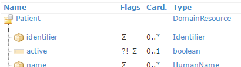

Model classes
-------------
For each Resource type and data type in FHIR, the API contains a class in the form of a public partial
class. If you need extra code to be performed when using these classes, you can just implement
your own partial class for it. That way you can keep your code separate from the API code.

Creating a new Patient resource instance, and an instance of the Identifier data type:

.. code-block:: csharp

	var pat = new Patient();
	var id = new Identifier();

Class fields
^^^^^^^^^^^^
The API classes have a field for each of the elements in the Resource or data type model.
For example, the Patient resource has an ``active`` element:

The Patient class in the API has a field called ``Active`` that corresponds with this element:
 
.. image:: ../images/api_patient_active.png

Likewise, the Identifier data type has an element called ``use``:

And the Identifier class in the API has a field called ``Use`` that corresponds with this element:
 

As you can see, the classes and fields all have inline documentation describing them.