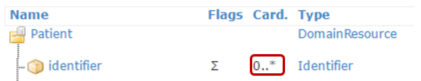
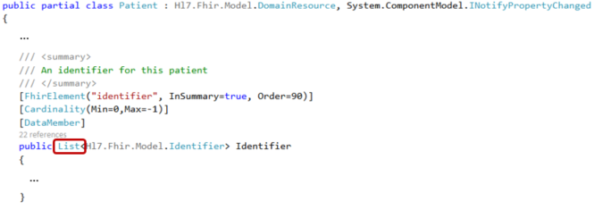

Lists
-----
For elements with a maximum cardinality > 1, the API has a list of the type for that element.

To work with data in a list, you can use the standard C# List methods.

So for example, if we want to add the ``Identifier`` we created in the previous paragraph
to the ``Identifier`` field of the instance of ``Patient`` we created earlier, we can
do this:

.. code-block:: csharp

	pat.Identifier.Add(id);

.. note:: If you did not initialize a field before adding to the list,
	the API will create the List for you, and will not generate a NullReferenceException.
