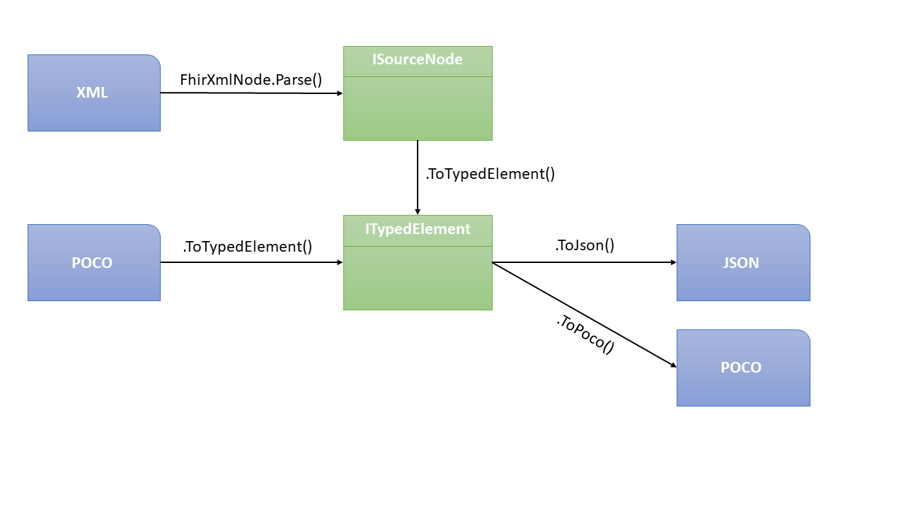

========================
ElementModel Summary
========================

The interfaces and methods described in this section are summarized in the picture below. Note that there are more conversions possible than shown (e.g. reading from an ``XmlReader`` is not explicitly depicted), and the API may be extended to support formats other than XML and JSON by the time you read this.

