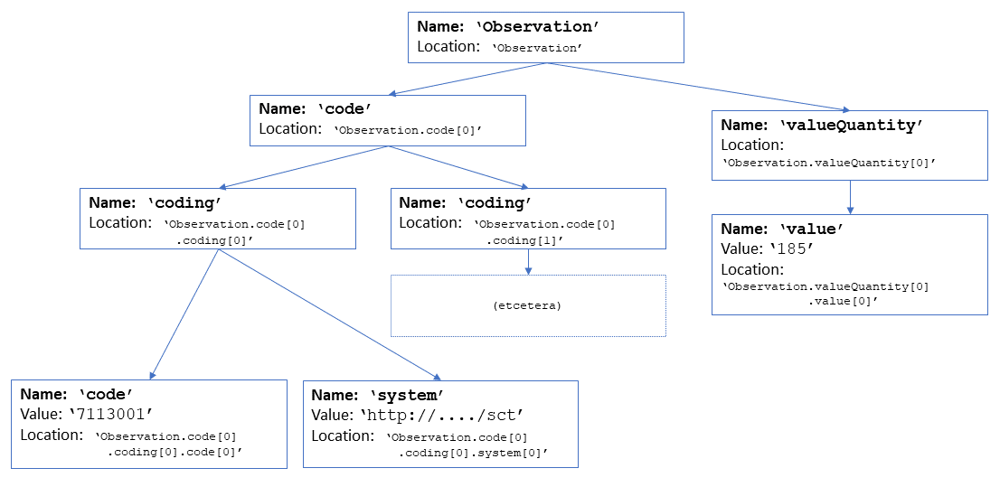

.. _isourcenode:

========================
Parsing with ISourceNode
========================

This interface exposes serialization-level, untyped instance data of a single resource at a level that abstracts away the specific details of the underlying representation (e.g. xml and json) and is shown below:

.. code-block:: csharp

    interface ISourceNode
    {
        string Name { get; }
        string Text { get; }
        string Location { get; }
        IEnumerable<ISourceNode> Children(string name = null);
    }

The interface represents a single node in the tree. Each node has a name, and a location (as a dot separated list of paths leading to the current node). The property ``Text`` contains the node's primitive data (if any).  

Note that the name of the node is often, but not always, the same as the name of the element in the FHIR specification. The two may differ if the element has a choice of types (e.g. ``Observation.value``). In this case, the name of of the source node is suffixed by the type, exactly as it would be in the serialized form. For the root of the tree, the name is the same as the type of the resource present in the instance.

Navigation through the tree is done by enumerating the children using the ``Children()`` method, optionally filtering on the name of the children.

Below is a tree which shows the instance data for an example Observation:

.. code-block:: json

    {
        "resourceType": "Observation",
        "code":
        {
            "coding": [ { "code": "7113001", "system": "http://snomed.info/sct" }, { "et" : "cetera" } ]
        }
        "valueQuantity":
        {
            "value": "185"
        }
    }

The tree represented by the ``ISourceNode`` can be represented like this:

Some of the more subtle point illustrated here are:

* The root of the tree is named after the type of the instance (visible in Json as "resourceType", and a root element in Xml)
* There is no explicit representation of an array of repeated elements, arrays are flattened into sibling nodes with the same name, just like repeating elements in Xml.
* The location ensures each node is named uniquely by suffixing each path with an array index ([0], [1], etc), even if the given element does not repeat according to the FHIR specification (remember, at this level we do not have type information, nor are we aware of the differences between different versions of FHIR, so this information is simply not available).
* The choice element ``value``, has its instance type (``Quantity``) appended to it: the name of the node in the tree agrees with the name of the element in the Json (or xml) serialization.

The API offers a set of extension methods on top of ``ISourceNode`` (like ``Visit()`` and ``Descendants()``) to make it easier to select subtrees and process the data in the tree.

Parsing
-------
The FHIR parsers available (currently for the FHIR Xml and Json formats) implement the ``ISourceNode`` interface and can be found in the ``Hl7.Fhir.Serialization`` assembly. The parsers are not created directly, instead there are two sets of factory methods, one for each serialization format: ``FhrXmlNode`` and ``FhirJsonNode``. The factory methods are:

* ``Read()``, to read data directly from an ``XmlReader`` or ``JsonReader``.
* ``Parse()``, to parse data from a string.
* ``Create()``, to turn XElements, XDocuments or JObjects into an ``ISourceNode``

All methods optionally take a ``settings`` parameter and return an ``ISourceNode``, which reprents the root of the data read. 

Here is an example parsing a string of xml and then quering some of its data:

.. code-block:: csharp

    var xml = "<Patient xmlns=\"http://hl7.org/fhir\"><identifier>" +
        "<use value=\"official\" /></identifier></Patient>";
    var patientNode = FhirXmlNode.Parse(xml);
    var use = patientNode.Children("identifier").Children("use").First();
    Assert.AreEqual("official", use.Text);
    Assert.AreEqual("Patient.identifier[0].use[0]", use.Location);

By swapping out the ``FhirXmlNode`` for an ``FhirJsonNode`` you can make this example to read Json data - there would not be any change to the rest of the code.

Constructing a tree in memory
-----------------------------
It is also possible to construct an in-memory tree with data "by hand", using the ``SourceNode`` class. Since ``SourceNode`` implements ``ISourceNode``, there would not be any difference from data read from a file or other source:

.. code-block:: csharp

    patient = SourceNode.Node("Patient", 
        SourceNode.Resource("contained", "Observation", SourceNode.Valued("valueBoolean", "true")),
        SourceNode.Valued("active", "true",
            annotatedNode,
            SourceNode.Valued("id", "myId2"),
            SourceNode.Node("extension",
                SourceNode.Valued("value", "4")),
            SourceNode.Node("extension",
                SourceNode.Valued("value", "world!"))));

Note that by using the C# ``using static Hl7.Fhir.ElementModel.SourceNode;`` this example could be make quite a bit shorter. 

Handling parse errors
---------------------
By default, parsing errors thrown as exceptions, but all parsers implement ``IExceptionSource`` to alter this behaviour. See :ref:`errorhandling` for more information. 

The parsers try to parse the source `lazily`, so in order to detect all parse errors, one would have to do a complete visit of the tree, including forcing a read of the primitive data by getting the ``Text`` property. There is a convenience method ``VisitAll()`` that does exactly this. Additionally, there is a method ``VisitAndCatch()`` that will traverse the whole tree, returning a list of parsing errors and warnings.
