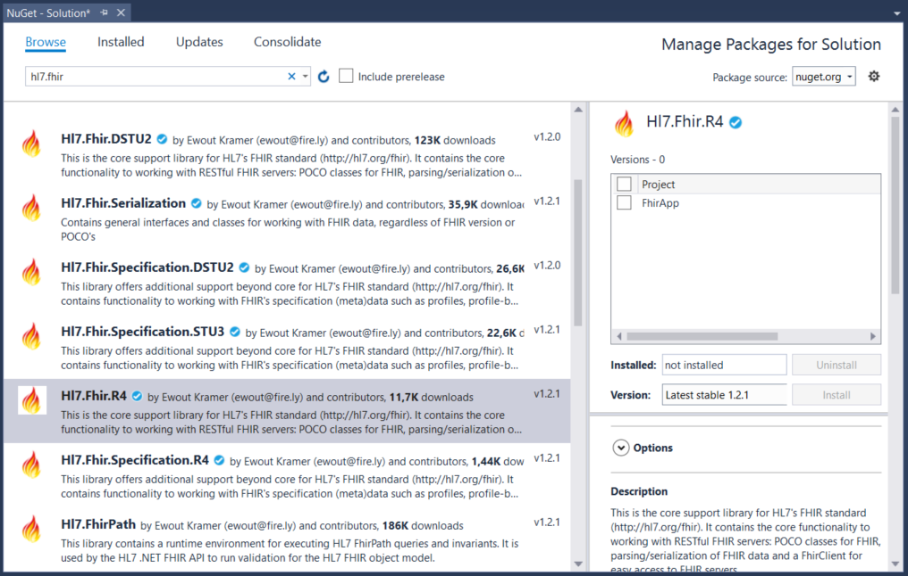

.. _api-getting-started:

===============
Getting Started
===============

It's easy to start using the FHIR .Net API in your solution: just add the right NuGet package!

Open your project, or start a new one and go to the NuGet Package Manager.
The current version of the FHIR specification is STU3. Usually you will need that version of
the FHIR .Net API as well. If you need to communicate with DSTU2 systems, or even DSTU1, there
are versions of the API for those as well.

For STU3, you will need the Hl7.Fhir.STU3 package:

1.	Choose Tools --> NuGet Package Manager --> Manage NuGet Packages for Solution...

2.	Click on Browse, and type fhir into the search field.

3.	Click on the package you need, in this case Hl7.Fhir.STU3.

4.	Check the box next to the name of your project and click on Install.

The :ref:`next section <FHIR-model>` explains how the API works with the FHIR model.

.. |br| raw:: html

    
