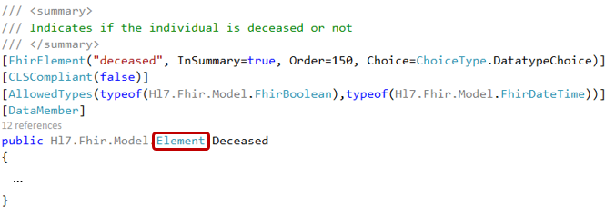

Choice properties
-----------------
In the FHIR specification, you will encounter 'choice properties' for some of the resource's elements.
This means that you can choose the type you fill in for that element, from the possible types listed.

For the Patient resource type for example, we have a choice for the ``deceased`` element:

.. image:: ../images/fhir_patient_deceased.png

In the SDK, you will see that the corresponding field is of type ``Element``, which is the base for
all data types.

This means that in your code, you will first have to create an instance of the data type of your
choice, before you can fill in the field. |br|
For example, if we choose to use a date for the ``Deceased`` field of our Patient, we could
implement that like this:

.. code-block:: csharp

	var deceased_date = new FhirDateTime("2015-04-23");
	pat.Deceased = deceased_date;

Or, if we choose to fill in a boolean value:

.. code-block:: csharp

	pat.Deceased = new FhirBoolean(true);

.. |br| raw:: html

    
   
The list of all available types is `available here <https://github.com/FirelyTeam/firely-net-sdk/tree/develop-stu3/src/Hl7.Fhir.Core/Model>`_ 
and `here <https://github.com/FirelyTeam/firely-net-common/tree/develop/src/Hl7.Fhir.Support.Poco/Model>`_. 
