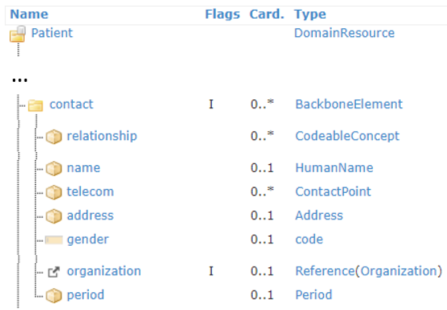
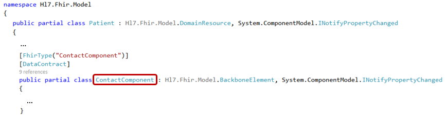

.. _components:

Components
----------
Resources can have elements with a subgroup of elements in them. These are called 'BackboneElements'
or 'components'. For example, the Patient resource type has a component called ``contact``.
	

In the SDK, a component block is represented by a class within the resource type class. This subclass
has the name of the field, followed by 'Component', for example ``ContactComponent`` in the
``Patient`` class:

Code example, adding contact details to our Patient:

.. code-block:: csharp

	var contact = new Patient.ContactComponent();
	contact.Name = new HumanName();
	contact.Name.Family = "Parks";
	// setup other contact details

	pat.Contact.Add(contact);
