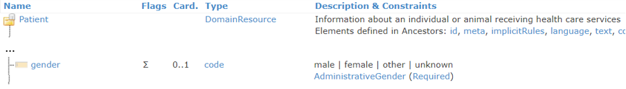
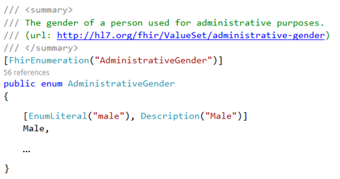

Enumerations
------------
For coded types in FHIR, the elements are bound to a ValueSet. When the specification states
that the ValueSet is 'Required', this means it is a fixed list of codes. The SDK provides an
enumeration for each fixed ValueSet. You can use these enumerations to fill in the correct value.

The Patient resource has a fixed ValueSet for the ``gender`` element.

Enumeration in the SDK:

Code example, adding a gender to our Patient:

.. code-block:: csharp

	pat.Gender = AdministrativeGender.Male;