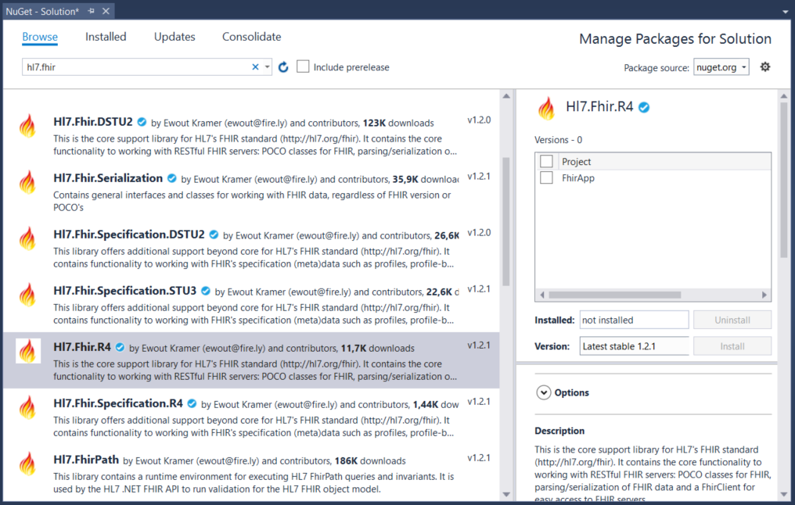

.. _sdk-getting-started:

===============
Getting Started
===============

It's easy to start using the Firely .NET SDK in your solution: start with the `right NuGet package <https://www.nuget.org/profiles/firely>`_.

Install via .nuspec
-------------------

    dotnet add package Hl7.Fhir.R4

Install via Visual Studio
-------------------------
Open your project, or start a new one and go to the NuGet Package Manager.
The current official version of the FHIR specification is R4, but you might be developing for one
of the previous versions. For each version of the specification, there is a corresponding library.

For R4, you will need the Hl7.Fhir.R4 package:

1.	Choose Tools 🠮 NuGet Package Manager 🠮 Manage NuGet Packages for Solution...

2.	Click on Browse, and type fhir into the search field.

3.	Click on the package you need, in this case Hl7.Fhir.R4.

4.	Check the box next to the name of your project and click on Install.

The :ref:`next section <FHIR-model>` explains how the SDK works with the FHIR model.

.. |br| raw:: html

    
