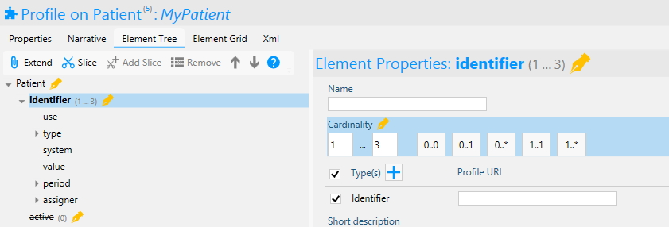
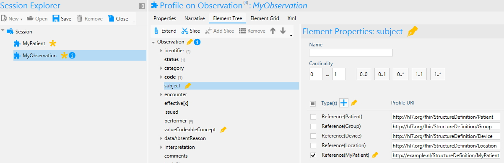
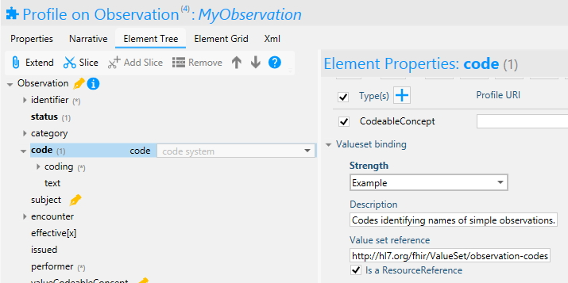
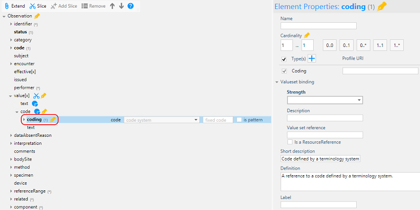
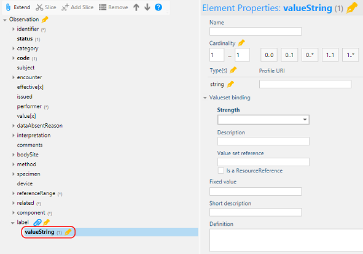

# Define Constraints

An important option for the editing of Element Properties is the option
to add constraints. In Forge you can add one or more constraints to an
element. This section shows how to place cardinality constraints, edit
element types and valueset bindings. In addition, with Forge it is also
possible to specify the Constraint Key, Requirements, Severity,
Description, and XPath expression. 

## Cardinality

Adjusting the cardinality of an element might be the backbone in
profiling FHIR. Forge offers the five most used cardinality options as a
shortcut but it is also possible to enter the desired cadinality values
in de \'Element Properties\' as shown in the screenshot below. Note that
profiles may only further restrict the base resource. For example, it is
not allowed to make the maximum cardianlity greater than the base
Resource\'s maximum cardinality. Forge shows a warning message when this
happens.

## Element Type

Some elements in the FHIR specification contain multiple data types. For
example, the element \'value\[x\]\' in the Observation resource. In your
profile, it is possible to constrain this to the desired data type(s).
Forge allows you to place these constraints in the Element Properties by
checking only the wanted datatypes. The screenshot below shows the
unconstraint Type situation of the \'value\[x\]\' element in the
Observation resource. It is also possible to provide a custom datatype
by entering the URI of the datatype profile after the checked Type. A
Type can also be a reference to another Resource profile. Forge
automatically gives the profile as a Type option if the profile is
opened in the session explorer and the profile\'s base Resource fits the
element.

*Setting Observation.value[x] types in Forge*
![Setting Observation.value[x] types in Forge](../images/ConstraintsType.jpg)

*Setting Observation.subject reference type in Forge*

## Valueset binding

Some elements can be constrained with a valueset. A valueset can be
added or edited under \'Valueset binding\' in the \'Element
Properties\'. Here you can provide the valueset binding strength,
description and the reference to the valueset. Note that you cannot
relax the base Resource binding strength. The value must be equal to or
strichter than the base value.

## Inline constraints

FHIR allows you to constrain an element type by specifying a custom
(external) datatype or resource profile. Forge has always allowed you to
specify a profile url on an element type. But now, when you open a
profile, Forge also tries to resolve the external type profile and merge
it into your own profile.

Note: Forge does not (yet) dynamically resolve external profiles while
you are editing an element type. For now, you have to manually (save
and) reload the profile to enable to see and constrain (!) the expanded
external type profiles.

This feature allows you to specify inline constraints that "walk into"
elements defined by external type profiles.

This behavior also applies to Extension Definitions, as technically they
are also external type profiles. Suppose you author a profile with an extension element. The profile extension element is mapped to a common Extension definition. Now when you open the profile in Forge 14.7, the application will try to resolve the target extension definition and merge it into your profile. Now you can define inline constraints on child elements of the extension in your profile to override constraints in the underlying extension definition.

