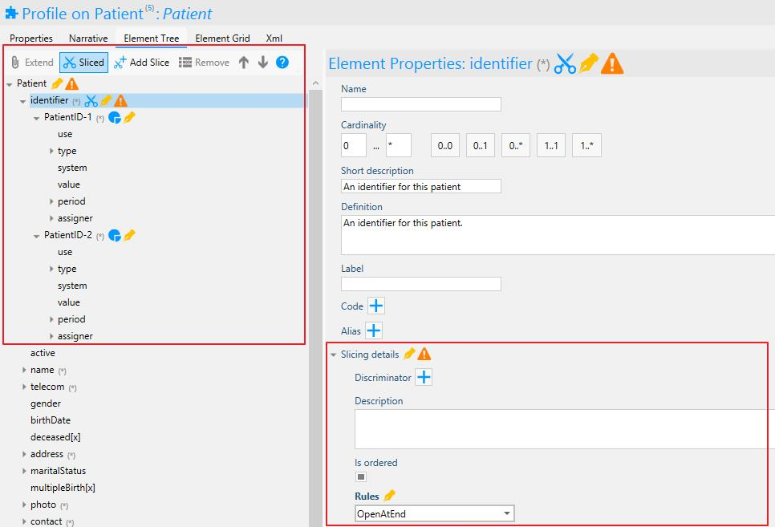

# Define Slices

To further customize a base Resource you can slice available elements to
capture a variety of the same element. This is particularly helpful when
you want to capture multiple versions of an element of your base
Resource. For instance multiple patient identifiers or multiple name
parts. This allows you to define specifics such as CodeableConcepts for
each part of the sliced object. This process entails slicing a structure
element into sub items. The sub items that are created are then referred
to as slices. 

## Slicing in Forge

Select the element that you want to slice and click on the scissor icon.
The element is now 'Sliced' and it is possible to add slices by clicking
the scissor icon with a little plus. You can create as many slices as
necessary by selecting the sliced element and clicking the Add Slice
icon again. The added slices can be defined and constrained as any other
element. 

## Discriminator

After adding slices, Forge shows a warning message containing the
message that there is no discriminator defined for the sliced elements.
The discriminator is used to distinguish the sliced elements from one
another. The discriminators in their sum should allow applications to
easily determine which slice belong to each section. The discriminator
information can be provided in the Element Properties of the sliced
element under Slicing Details.

More information concerning slicing and discriminators can be found
here: <http://hl7.org/fhir/profiling.html>. 

## Type Slicing

Type slicing applies to so-called polymorphic "choice type" elements that support
multiple data types. A choice type element has a name that ends with
"\[x\] ", e.g. Observation.value\[x\]. Using type slicing, you can
define constraints for specific element types. Per definition, the
slicing discriminator of a type slice is equal to "\@type". Each slice
constraint you define must have a unique type.

