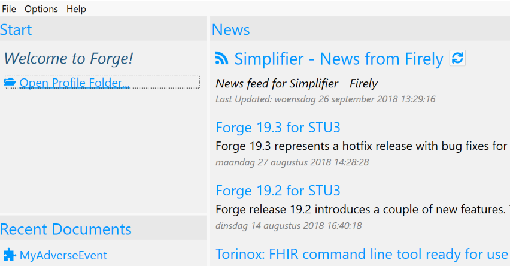
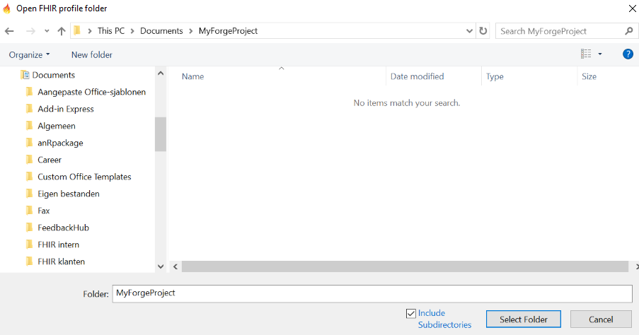
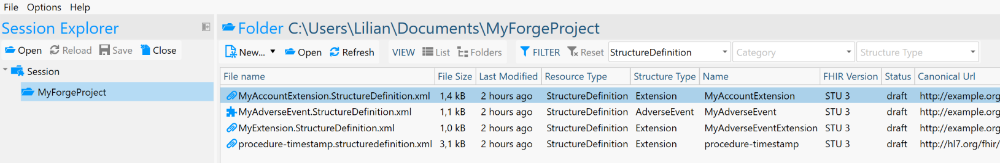

# Open a Profile folder

When you want to start working in Forge, you will first need to open a
profile folder (i.e. the working directory containing your profiles).
When you select an item from your recent documents, Forge will
automatically open its associated profile folder. In any other case
click `Open Profile Folder...` and select your working directory.

Note that although Forge allows you to select any folder, it would be a
very bad idea to select a general folder like "C:/Documents" as your
profile folder. If you don't have a specific folder for your project,
please create one. For example, let's open my profile folder called
MyForgeProject. By default subdirectories are not included. Select this
option to include all subdirectories of the selected folder. This may be
convenient if you want to organize your profiles in separate folders,
but still want to be able to edit them in the same project. On the other
hand, if you have a subdirectory containing old versions of your
profiles, it would be better to ignore the subdirectory.

Click `Select Folder` to open your folder. Now Forge will show you all
profiles and extensions contained in your folder.

When there's a lot of content in your folder, you may want to use one of
the available filters to filter on structure type (e.g.
StructureDefinition), category (e.g. profile or extension) or resource
type (e.g. Patient ).

You can also switch views. By default the `List` view is shown, showing
all content in the folder and all its subdirectories (when these are
included). The `Folders` view allows you to browse the subdirectories
one by one as if you're using your file explorer.

Select one of the structure definitions from the content list and choose
`Open` to open it in Forge. Choose `New` to add new structure
definitions to your project. Note that they will not be saved
automatically. To add a newly created structure definition to your
project, select Save and save it to your
profile folder. Use the `Refresh` button to update the content list.

In the Session Explorer, you can choose
Open to open another profile folder. Note
that this will not automatically close your current profile folder. To
close a profile folder, select the folder in the Session Explorer and
select `Close`. Or select a single item in your project to close.