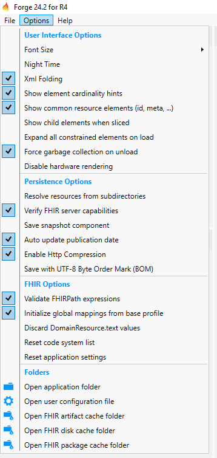
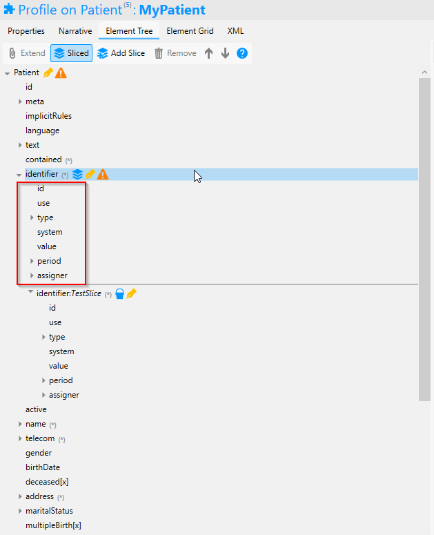

# Set Forge Options

Forge provides several options regarding rendering and saving. 

## User Interface Options

### Show child elements when sliced
This option allows you to see the constraints that can be put on the sliced element. These constraints are implemented on all the slices. This is summarized in the "All slice" once rendered on Simplifier. 

## Persistance Options

### Save snapshot component

On default Forge saves your work as a differential. Forge is capable of
saving your work as a snaphot. The Options menu provides a set of
configuration settings that control the behavior of snapshot expansion

Want more information on the options in Forge? Feel free to reach out to <forge@fire.ly>.

