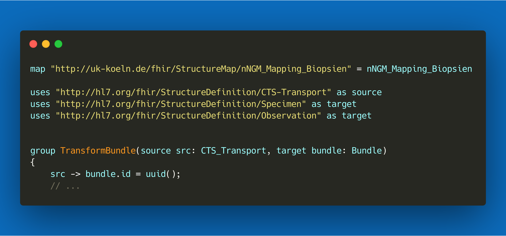

.. _mappingengine_index:

Welcome to the FHIR Mapper documentation
=====================================================

The FHIR Mapper is Firely's implementation of the `mapping language <https://www.hl7.org/fhir/mapping-language.html>`_,
available as a Vonk plugin. With this engine you're able to transform data from a variety of formats - CDA, HL7 v2,
or even your custom ones - to other formats such as FHIR or custom ones.

On these pages we provide you with the documentation you need to get up and running with the FHIR Mapper,
as well as information on how to contact us when you have additional needs, such as a custom implementation
or support contract.

.. toctree::
   :maxdepth: 1
   :titlesonly:
   :hidden:
   

   start
   enginesetup/configuration
   featureslist/featureslist
   transformsetup/overview
   runningtransforms/runningtransforms
   specialconsiderations/considerations
   contact
.. add files here
