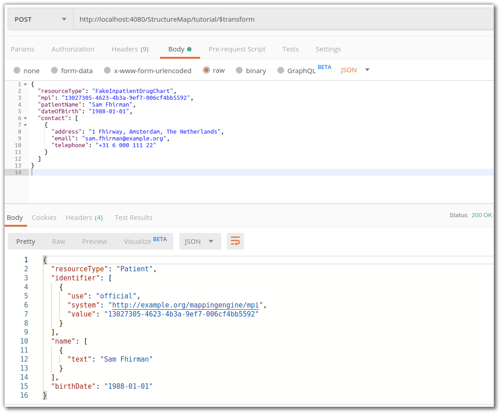

.. _running_transforms:

Running transformations
=======================

Once your transforms are setup (:ref:`setup_transforms`), you can run your data conversion!

To do so, ``POST http(s)://<firely-server-endpoint>/administration/StructureMap/<logical id>/$transform`` with content to transform as the resource body. Make sure to set the ``Content-Type`` to either ``application/json`` or ``application/xml`` accordingly.

For the example we've been working with so far, ``POST http://localhost:4080/administration/StructureMap/FHIRMapperTutorial/$transform`` with a `sample resource <https://simplifier.net/fhirmapper/FakeInpatientDrugChart-example/~json>`_ as the body.

Simplified sample call:

With this done, your custom resource and mapping file is registered in Firely Server, and your data transformation is working. Gefeliciteerd! 🎉
