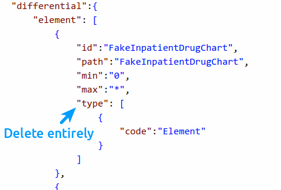

.. _mappingengine_create_logical_model:

Logical Model
=============

If you're working with custom resources, you need create a model of your data to describe it to the mapping engine. If you're working with FHIR resources, it already has the models available, so you can skip this step.

1. Describe your logical model in Forge: see :ref:`forge_logical_models`. An example model `is available <https://simplifier.net/.netfhirmappingengine/fakeinpatientdrugchart>`_ and we'll it in the following documentation:

.. image:: ../images/sample-logical-model.png

2. Next, convert your logical model to a custom resource:

   2.1. Set ``.kind`` to ``resource``.

   2.2. Ensure the ``.url`` starts with ``http://hl7.org/fhir/StructureDefinition`` (this is a temporary limitation).
   
      2.2.1. In our example, change from ``http://example.org/mappingengine/fhir/StructureDefinition/FakeInpatientDrugChart`` to ``http://hl7.org/fhir/StructureDefinition/FakeInpatientDrugChart``.
   
   2.3. Remove the URL from ``.type`` and set it to just a name.

      2.3.1. In our example, change from ``http://example.org/fhir/StructureDefinition/FakeInpatientDrugChart`` to ``FakeInpatientDrugChart``.

   2.4. Set the ``.baseDefinition`` to ``http://hl7.org/fhir/StructureDefinition/DomainResource``.

   2.5. Delete the ``type`` field from the first ``.differential.element`` (and ``.snapshot.element`` if you have it):

2.6. If you only have a ``.snapshot`` in your model and no ``.differential``, rename the ``.snapshot`` to ``.differential`` (this is a temporary limitation).