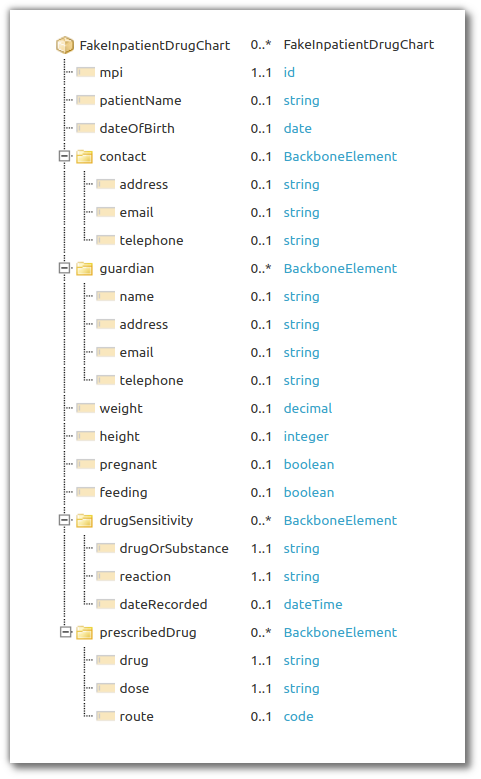

.. _mappingengine_create_logical_model:

Logical Model + Custom Resource
===============================

If you're working with a custom format that you want to transform, you need create a model of your data to describe it to the FHIR Mapper. If you're working with FHIR resources as your source data, Firely Server already has the models available, so you can skip this step.

1. Describe your logical model in Forge: see :ref:`forge_logical_models`. An example model `is available <https://simplifier.net/fhirmapper/fakeinpatientdrugchart>`_ and we'll use it in this documentation.

2. Next, convert the logical model you've made to a custom resource:

   2.1. Ensure the ``.url`` starts with ``http://hl7.org/fhir/StructureDefinition`` (this is a temporary limitation).

      2.1.1. In our example, change from ``http://example.org/mappingengine/fhir/StructureDefinition/FakeInpatientDrugChart`` to ``http://hl7.org/fhir/StructureDefinition/FakeInpatientDrugChart``.

   2.2. Set ``.kind`` to ``resource``.

   2.3. Remove the URL from ``.type`` and set it to just a name.

      2.3.1. In our example, change from ``http://example.org/fhir/StructureDefinition/FakeInpatientDrugChart`` to ``FakeInpatientDrugChart``.

   2.4. Add a ``.id`` element at the root level with the name of the custom resource.

      2.4.1. In our example, set ``.id`` to ``FakeInpatientDrugChart``.

   2.5. Set the ``.baseDefinition`` to ``http://hl7.org/fhir/StructureDefinition/DomainResource``.

   2.6. Delete the ``type`` field from the first ``.differential.element`` (and ``.snapshot.element`` if you have it):

   .. image:: ../images/delete-first-type-from-logical.png
     :align: center

   2.7. If you only have a ``.snapshot`` in your model and no ``.differential``, rename the ``.snapshot`` to ``.differential`` (this is a temporary limitation - basically, ensure that you have a ``.differential``).

If you'd like to double-check, `this is how <https://simplifier.net/fhirmapper/FakeInpatientDrugChart-custom-resource/~json>`_ our example custom resource looks like now with all the changes applied.

3. Finally, upload your custom resource to Firely Server's ``/administration`` endpoint:

   3.1. ``PUT`` the resource to ``http(s)://<firely-server-endpoint>/administration/StructureDefinition/<custom resource name>``.

      3.1.1 In our example, ``PUT http://localhost:4080/administration/StructureDefinition/FakeInpatientDrugChart`` with the resource in the body.

With the custom resource uploaded to Firely Server's administration point, we have now taught Firely Server about a new resource type!

You can verify this by running ``GET http(s)://localhost:4080/<custom resource name>`` (in our example ``GET http://localhost:4080/FakeInpatientDrugChart``). The query will return 0 search results instead of an error message "Request for not-supported ResourceType(s)".

Next we'll create a mapping between our custom resource and FHIR STU3 resources.
