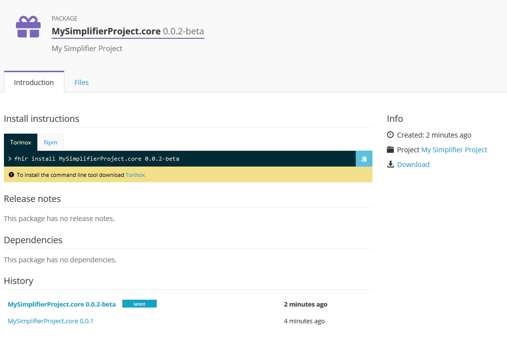
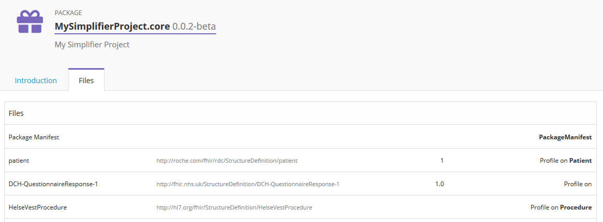
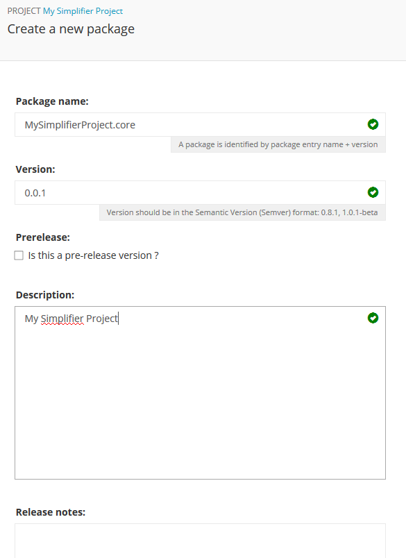
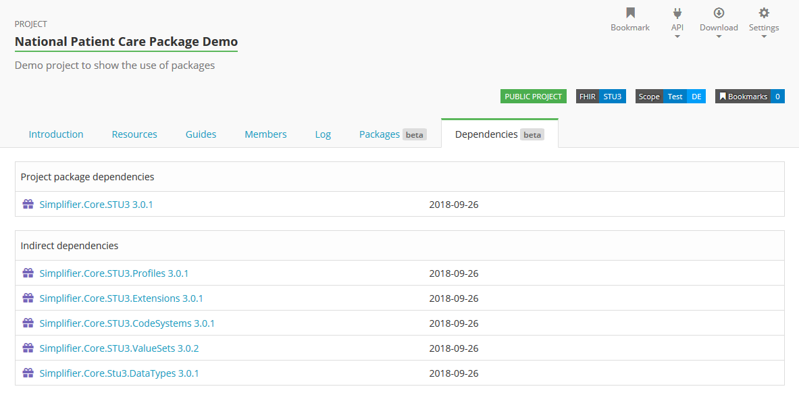
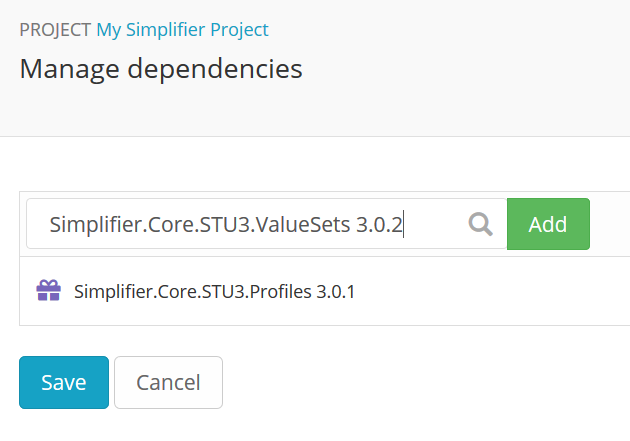
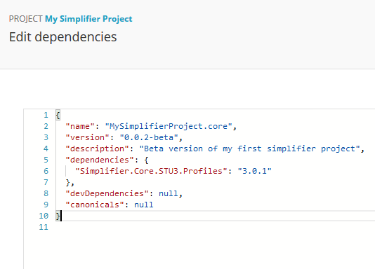

Package management
========================
Simplifier.net offers functionality to handle packages and dependencies. This functionality allows you to publish packages based on your project resources, which can be immediately installed and used by people implementing your profiles. The Simplifier FHIR package server is NPM compatible. You may either connect to this server using a NPM client or use our cross platform FHIR command line tool called Torinox. On this page we will explain how to manage packages and dependencies in Simplifier, how to use Torinox to install packages for validation, how to manage packages and how to create your own packages in Torinox.

Packages
---------------------------

View packages
^^^^^^^^^^^^^
Visit the ``Packages`` tab of any Simplifier project to see which packages are available in this project. For more information about a package and its content, click on the name of the package. 

The ``Introduction`` page will give you an overview of the package:
* Install instructions; shows the command you need to install the package, click on the blue copy icon to copy it to your clipboard. Click on Torinox or NPM to switch to your preferred tooling.
* Release notes; shows the release notes given by the author of the package.
* Dependencies; shows the dependencies to other packages.
* History; shows the previous versions of the package, click on a version name to see the details.
* Info; shows information about when the package was created, a link to the project it is part of and a download button to download the package.

Switch to the ``Files`` tab to see the content of the package. 

Publish packages
^^^^^^^^^^^^^^^^
Visit the ``Packages`` tab of your project and click on ``Create`` > ``Create new package`` to create a new package. Provide a name, version number, description and release notes for your package. Note that the name of your package should include at least one dot. Indicate if your package is a prelease package or not and click ``Create`` to publish your package. 
To create a new version of an existing package, click on ``Create`` and select ``Create new version for..`` followed by the name of your package. Add the required information and click ``Create`` to publish the new version of your package.

  
Dependencies
-----------------------

View dependencies
^^^^^^^^^^^^^^^^^
Visit the ``Dependencies`` tab of any Simplifier project to see a list of its package dependencies as well as indirect dependencies. Click on the name of one of the listed packages to see the details of this package. This will show the information as explained in the View Packages section.

Add dependencies
^^^^^^^^^^^^^^^^
Visit the ``Dependencies`` tab to add dependencies to your project. There are two ways to do so. One way is to browse Simplifier for existing packages and add them to your project. The other way is to directly edit the JSON code.

Click ``Manage`` to search for existing dependencies. Type a search string in the search box and select a package and its version from the search results. Click ``Add`` to add the package to your project. When you are finished adding packages click ``Save`` to save the changes to your project.

Click ``Edit`` to directly edit the JSON code and add the packages and their version to ``dependencies``.

Remove dependencies
^^^^^^^^^^^^^^^^^^^
To remove dependencies from your project, you could either select ``Manage`` and click on the recycle bin icon next to the package you want to remove or select ``Edit`` to directly edit the JSON code.

Torinox
-----------------------
Torinox is our (free) command line tool for FHIR. Torinox allows you to communicate with any FHIR server. With simple commands you can easily download, upload, validate and transform resources, zip them, bundle them or split bundles. Torinox offers many features. One of them is to install, create and manage FHIR packages.

Install Torinox
^^^^^^^^^^^^^^^
Before you install Torinox, make sure you have `dotnet core 2.1 SDK <https://www.microsoft.com/net/download/>`_. installed. Next, run the following command in your command line window: 

``dotnet tool install -g torinox``

That's it, you're all set! Run ``fhir -?`` to see which functions are available. Here below are a couple of examples in Torinox.

.. image:: ./images/Torinox.PNG
  :align: center

Install packages
^^^^^^^^^^^^^^^^
Copy paste the install command from the install instructions in the package details on Simplifier. For example, try to install a demo package from the National Patient Care Package Demo project. Make sure to do a restore afterwards, so Torinox will calculate and install all dependencies as well.

``fhir install Demo.National.PatientCare 1.0.0``
``fhir restore``

Resource validation
^^^^^^^^^^^^^^^^^^^
When all required packages have been installed, you can start validating your resources. First, set up your FHIR server if you haven't done this earlier. 

``fhir server add vonk https://vonk.fire.ly``

Next, get an example Patient from your server.

``fhir read vonk Patient/example``

Finally, run the command to validate this resource.

``fhir validate``

Note that the validation will only work when you have all packages and dependencies installed.

Create package
^^^^^^^^^^^^^^
Torinox allows you to create packages from your folder. For example, create a folder called 'MyDemoProject' on your machine and place one or more profiles in this folder. In addition, place a file called package.json in this folder to define your package:

.. code-block:: Javascript

   {
     "name": "MyDemoProject.core",
     "version": "0.0.1",
     "description": "My demo project",
     "devDependencies": null,
     "canonicals": null,
     "dependencies": {
     }
   }

Now you can create your package in Torinox:
``fhir pack C:\MyDemoProject``

Run the following command to get the contents of your new package:
``fhir contents MyDemoProject.core``

Package management
^^^^^^^^^^^^^^^^^^
Torinox supports a couple of commands which allow you to manage your packages. Here below are a couple of examples:

Remove a package from your context:
``fhir remove Demo.National.PatientCare``

See which versions are available of a specific package:
``fhir versions Demo.National.PatientCare``
