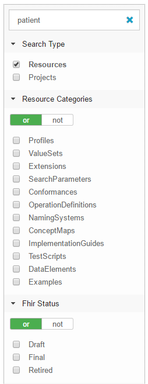

Browse Simplifier
========================
Simplifier content is organized at four levels: Users, Resources, Projects and Organizations. Simplifier allows you to get in touch with other users as well as to browse organizations, projects and resources from the homepage. 

Find other Simplifier users
---------------------------
When you visit the ``Members`` tab on a `project page <simplifierProjects.html#project-page>`_, you see which Simplifier users are involved in the project. By clicking on a project member, you will navigate to his or her `user profile <simplifierPersonalContent.html#user-profile>`_. Here you can find more information about this user, such as his or her activity on Simplifier and other projects this user is involved in. You can also get in touch with this user by using his or her contact details or sending a direct message.

Search existing content
-----------------------
To explore existing resources, projects and organizations simply type a search phrase into the ``Search`` field at the top of the Simplifier homepage. This search allows you to browse through publicly available organizations, resources and projects. Once you reach the page with your search results you will notice that you have a few options to further specify your results. In the left hand menu you will find options to limit the results to Organizations, Projects or Resources.

Your search results are RESTful, meaning that you can send your search results exactly as you have edited them to another using the URL. The person that you are sending the results to will receive the search results just as you have filtered them.

Search for FHIR resources
-------------------------
Simplifier is a repository for FHIR resources. There are a multitude of resources that are available to the public including profiles, extensions, valuesets, dictionaries, mappings, examples and more. If these resources are listed as public then you can find them here. 

You can browse these resources easily from the Simplifier homepage or from within a specific project. To search for a specific resource navigate to the search box and type the term in the search field. When searching from the homepage, select Resources from the Search Type options, to limit your search results to resources. When searching from the Resources tab in a project, this option will be selected automatically. You can apply additional filters such as Resource Categories and Fhir Status to make your search more specific.

Once you have found the resource you are looking for select it to see further details. Within the `resource page <simplifierResources.html#resource-page>`_ you can view which project that resource is a part of, the type, status (maturity level), versioning, and different resource views. 

Search for projects
-------------------
All content in Simplifier (e.g. resources and Implementation Guides) is organized in projects. Projects may be linked to an organization (depending on the account level) or stand alone. To search for projects, select the option Projects under Search Type. You can use additional filters to search for more specific projects. For example you can filter based on Project Scope. This allows you to make a distinction between Core, International, National, Local, and Regional projects. If you select the National Project Scope, the Nationality filter option will open. Here you can select one or more nationalities.

Once you have found the project you are interested in, you can select it to navigate to the `Project page <simplifierProjects.html#project-page>`_ where all content of the project is organized. Here you will find a summary of the project, a list of the project's resources, Implementation Guides, project members and log information.

Search for organizations
------------------------
The ability to search by organization allows you to easily find an organization's work and profile. Click Organizations under Search Type and type the name of the company you are interested in. Once you have found the organization you are interested in, you can select it to navigate to the `Organization page <simplifierOrganizationPortal.html#organization-portal>`_. Here you will find additional information about the organization as well as a list of projects that are linked to this organization.
