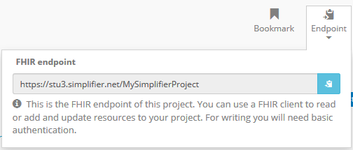
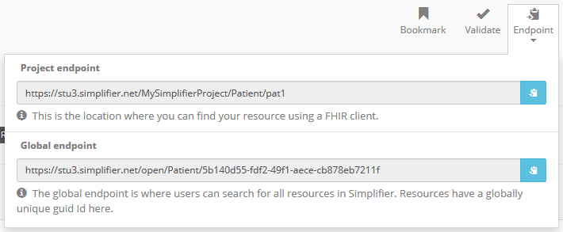

Endpoint
^^^^^^^^
The endpoint of a project or resource can be used to either search for resources in Simplifier or to read, search, add and update resources in a FHIR client. To retrieve the endpoint of a project or resource in Simplifier click on ``Endpoint`` in the top right menu when visiting either the project or resource page.

Project endpoint
""""""""""""""""
On the project page you can retrieve the FHIR endpoint of your project. You will need this when you want to use a FHIR client to read or add and update resources to your Simplifier project. For example, the Vonk FHIR server supports the import of resources from Simplifier by supporting a (manual) import operation and specification of the project's endpoint and authentication in the appsettings.

Resource endpoint
"""""""""""""""""
On the resource page you can retrieve the FHIR endpoint of your resource. You will need the project endpoint to find your resource when using a FHIR client. In addition, a global endpoint of your resource is available. Users can search for all resources in Simplifier using the global endpoint. For example, the request ``GET https//stu3.simplifier.net/open/Patient`` can be used to retrieve all (STU3) Patient resources from Simplifier. Resources have a globally unique GUID here.

