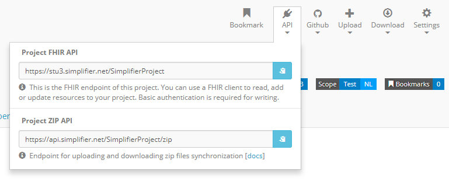
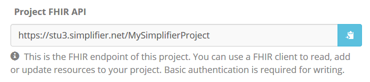
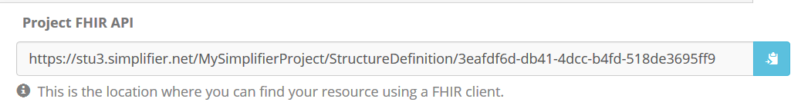
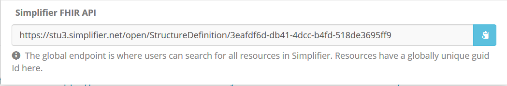

.. _simpl_endpoint:

API
^^^^^^^^
The endpoint of a project or resource can be used to either search for resources in Simplifier or to read, search, add and update resources in a FHIR client. System wide searches and history searches are also supported. To retrieve the endpoint of a project or resource in Simplifier click on ``API`` in the top right menu when visiting either the `project <simplifierProjects.html#project-page>`_ or `resource <simplifierResources.html#resource-page>`_ page. The below image shows the location.

Project FHIR API
""""""""""""""""
The project FHIR API is available at both project and resource level. You will need the FHIR endpoint when you want to use a FHIR client to read or add and update resources to your Simplifier project. For example, the Firely Server - FHIR server supports the import of resources from Simplifier by supporting a (manual) import operation and specification of the project's endpoint and authentication in the appsettings.

On the project page, you can retrieve the FHIR endpoint of your project.

On the resource page, you can retrieve the FHIR endpoint of your resource. You will need this endpoint to find your resource when using a FHIR client.

Project ZIP API
"""""""""""""""
The project ZIP API is available at project level. You can use the ZIP endpoint for synchronization. With an HTTP tool you can use GET or PUT https://api.simplifier.net/<yourproject>/zip to retrieve or update your project in zipped form.

JWT authentication
------------------
The ZIP endpoint is available for Simplifier users based on JWT authentication. 

First retrieve a JWT token from Simplifier. This works with a POST at https://api.simplifier.net/token with your account details in the message body in JSON format. Header should be Content-Type: application/json

::
  
  POST https://api.simplifier.net/token 
  
  Header:
  Content-Type: application/json

  Body:
    {
       "Email": "youremail@example.com",
       "Password": "your password"
    }
    
Downloading or uploading your project works with a GET or a PUT at https://api.simplifier.net/<project>/zip with an authorization header that includes your retrieved token as shown below. The token is valid for 8 hours.

::
  
  GET https://api.simplifier.net/<yourproject>/zip
  
  Header:
  Authorization: Bearer <access_token> 

Simplifier FHIR API
"""""""""""""""""""
Using the global Simplifier FHIR API, users can search for all resources in Simplifier. For example, the request ``GET https://stu3.simplifier.net/open/Patient`` can be used to retrieve all (STU3) Patient resources from Simplifier. The global Simplifier endpoint of your resource is available at the resource page beneath the API icon. All resources have a globally unique GUID.

Search Parameters 
-----------------
It is possible to use search parameters and search result parameter to filter the results from Simplifier. All parameters, with the exception of 'description', follow the STU3 FHIR specification. The following parameters are implemented:

Search paramters

=============  ==========  =============================================================   ================================
Name           Type        Description                                                     Expression
=============  ==========  =============================================================   ================================
url            uri         The uri that identifies the structure definition                StructureDefinition.url
type           token       Type defined or constrained by this structure                   StructureDefinition.type
status         token       The current status of the structure definition                  StructureDefinition.status
publisher      string      Name of the publisher of the structure definition               StructureDefinition.publisher
jurisdiction   token       Intended jurisdiction for the structure definition              StructureDefinition.jurisdiction
kind           token       (primitive-type | complex-type | resource | logical) |br|       StructureDefinition.kind
                           Only accepted value is "logical", the rest of the |br|
                           values will return non-logical model resources. |br|
                           (So this parameter will distinguish between |br|
                           profiles and logical models)
description    string      Will look at the publication description used in |br|           StructureDefinition.description
                           Simplifier (set either manually by user or generated |br| 
                           automatically using the FHIRpath metadata expressions |br|
                           written in project settings), not the description |br|
                           value inside the Confromance Resources. |br|                
=============  ==========  =============================================================   ================================

Search result parameters

=============  ============================================================================================    
Name           Description                                           
=============  ============================================================================================    
_sort          Only default "lastUpdated" is implemented.     
_count         Default value is "false". The parameter _count is defined as a hint to 
               Simplifier regarding how many resources should be returned in a single page.       
_summary       The _summary parameter requests the server to return
               a subset of the resource. 
=============  ============================================================================================    

.. |br| raw:: html

    

Examples

* type |br|

::

  GET https://stu3.simplifier.net/<yourproject>/Patient
  
* description |br|

::

  GET https://stu3.simplifier.net/<yourproject>/StructureDefinition?description:contains=<searchedterm>

* _summary |br|

::

  GET https://stu3.simplifier.net/<yourproject>/StructureDefinition?_summary=true
