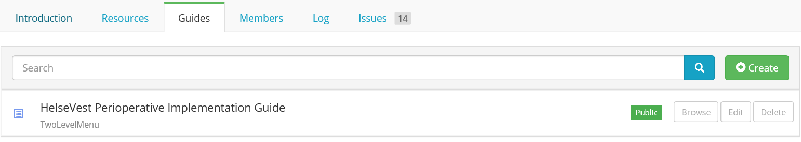
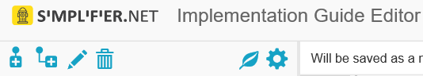

Implementation Guide Editor
===========================
The Implementation Guide Editor enables you to make implementation guides (IG) using the resources available in Simplifier. You can include your own project's Resources or those from others in your IG. 
With the help of this Markdown based editor you can easily construct an organized and practical IG that is both easy to read and navigate. This IG editor is available in all Simplifier account plans. Visit https://simplifier.net/pricing for more details.

This page will elaborate further on getting started and how you can use the IG editor.

Create your first IG
--------------------
You can access the IG editor via the ``Guides`` tab in your project. In earlier versions of Simplifier, Implementation Guides were created from a user's portal, but this is no longer possible as Implementation Guides are linked to a specific project. Use the ``Create`` button to create a new Implementation Guide and provide a title for the IG. 



Click on ``Browse`` or the Implementation Guide itself for a preview of the guide. Click on the ``Edit`` button to open the Implementation Guide in the IG editor. 

IG Editor Settings
------------------
The IG editor opens on the page of the root element. The IG Editor consist of three sections. On the left is the IG's tree table which is used to define the outline of your IG and navigate between the pages of the IG. The middle section is the actual editor. This is where you will add and edit content. The right section is where you will find a rendering of the selected page. 

By way of dragging the section bars you can adjust the size of each section to customize your view.

To adjust the settings of your IG click on the Settings icon (the rightmost icon representing a gear wheel). This brings you to a section that allows you to adjust the title and privacy on the Settings tab, or select an IG rendering format and Stylesheet file on the Style tab. 




Two Level Menu vs Tree table
^^^^^^^^^^^^^^^^^^^^^^^^^^^^^ 

An IG can be rendered in two formats: a Two Level Menu format and a Tree Table format.

A Two Level Menu rendering will display your IG with the elements in tabs along the top of the page.


.. image:: http://i32.photobucket.com/albums/d41/sdfgsdg1asdj/5.IGblog_zps3cloxvdy.png


A Tree table rendering will display your IG with the elements in a format similar to the tree table with the elements and their hierarchy along the left side of the page.


.. image:: http://i32.photobucket.com/albums/d41/sdfgsdg1asdj/0c898a190d7241b9a4e48e739a87af8f_zpszdeyzndo.jpg

To add a new menu item to your Implementation Guide, use the ``+`` icons in the upper left corner of the IG editor. Click on either the ``add Child guide item`` icon to add a sub menu or on the ``add Sibling guide item`` icon to add a menu at the same level as the one you have selected. You can rename the items by either double clicking them or use the pencil icon in the icon bar. To delete a menu item, select it and click on the recycle bin icon. 

CSS-editor
^^^^^^^^
When you click on the icon on the left of the Settings icon, the CSS-editor will be opened. With this editor you can edit your Style Sheet to make overall changes in the overall look and feel of your IG. For example, you may change the color of the navigation bar to blue or add your own logo to it. It is also possible to reset your changes by going back to the original CSS or download the original CSS as a seperate file, so you can compare the differences with your own code.

Markdown 
^^^^^^^^
In the middle section is a Markdown based editor used to compose your IG content. 
Markdown is a text-to-HTML conversion tool. 
It allows you to write using an easy-to-read, easy-to-write plain text format. 
The following link provides an overview of the Markdown features which can be used in this editor: https://github.com/adam-p/markdown-here/wiki/Markdown-Cheatsheet.

A short summary of frequently used features are as follows:

- Header size edits using ``#Header size 1`` to ``######Header size 6``
- Adding Emphasis, also know as italics, with ``*asterisks*`` or ``_underscores_``
- Adding Strong emphasis, also known as bold, with ``**asterisks**`` or ``__underscores__``
- Adding Combined emphasis with ``**asterisks``` and ``_underscores_**``
- Strikethrough uses two tildes. ``~~Scratch this.~~``


The IG editor has features which allow you to include Simplifier content in your IG. 
These features work by using the statements written below in the editor. 
After adding these statements in the editor refresh the page, by pressing Crtl + Enter or clicking the Refresh button, to make them visible in the preview section. 

- {{tree:ProjectName/ResourceName}}		    - renders a tree structure as seen in the resource overview tab
- {{table:ProjectName/ResourceName}}		- renders a table as seen in the resource table tab
- {{structure:ProjectName/ResourceName}}	- renders the resource in a newly defined tree (unfinished)
- {{link:ProjectName/ResourceName}}			- provides a link to the specific resource page on Simplifier
- {{namingsystems:ProjectName}}				- lists all namespaces of a project in a table

The statement is made up of 2 parts: the kind of function and the location of the content in Simplifier. 
The location is based on the name of the project and the name of the resource. 
They can be found in the Simplifier URL after the hostname (``https://simplifier.net/``). 
For example, if you want to include a profile on an Organization, as described at https://simplifier.net/DAF/daf-organization a correct statement would be {{tree:DAF/daf-organization}}. 

The following statements add an index within the IG. 

- {{index:root}}	- gives an index of the entire IG 
- {{index:current}} - gives an index of the current selected element
