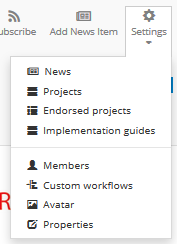
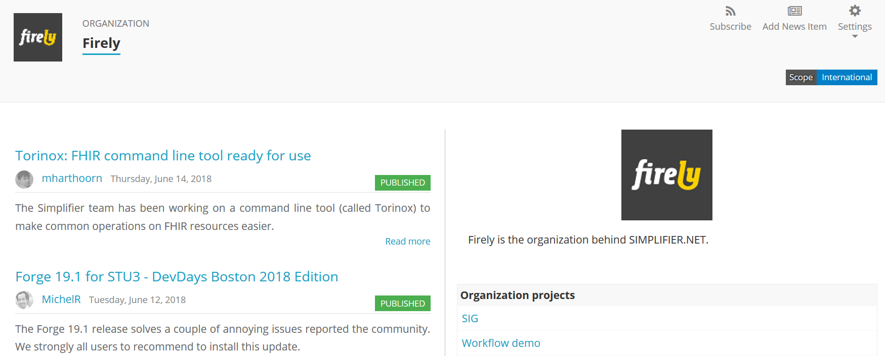
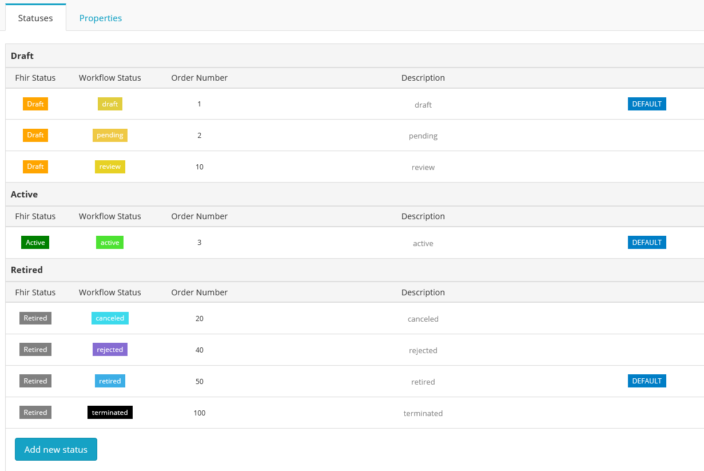

Organizations
^^^^^^^^^^^^^
For our members with an Enterprise plan there is the functionality to create and manage an organizational account within Simplifier. An Organization account allows you to create and share projects, resources, and Implementation Guides via your organization with others within and outside your organization. You can add members and adjust rights to the project.  

Organization Settings
---------------------
Once you have made your account you can create and organize organizational project lists, create custom workflows, manage members, and follow your organization’s newsfeed. These settings can be accessed via the ``Settings`` dropdown once you are on your organization’s page. The quickest way to visit your organization's page is to select it from the ``Organizations`` tab in your `personal portal <simplifierPersonalContent.html#personal-portal>`_

    
Organization Portal
-------------------
Your organization portal is a landing page for your organization that is visible to the outside world. On your portal you can add a logo, information about your organization and news feeds. Your organization portal also shows a list of your organization's projects.

Custom Workflow
-----------------
Custom workflows allows you to create statuses for your resources that fit your needs. You can use this to communicate to your organization team, in your own language, the progress of any given resource. This is in addition to the standard FHIR workflows of “Draft”, “Active”, and “Retired”. The FHIR workflows cover the following statues:

* Draft: This resource is still under development.
* Active: This resource is ready for normal use.
* Retired: This resource has been withdrawn or superseded and should no longer be used.

To create a Custom Workflow select ``Custom Workflow`` from the ``Settings`` dropdown on your organization’s page. The statuses that you make need to be mappable to the standard FHIR statuses. If you are creating your own workflows be sure to create a workflow for each associated level of the FHIR hierarchy. This is necessary because the FHIR statuses do not default into your custom list.

When you search for resources in Simplifier, the page with search results shows the Custom Workflow status next to the resource. You can click on the status to obtain an overview with the possible statuses and their explanations.

Organization Project Lists
--------------------------
Members with an Enterprise account have the ability to endorse others projects by creating ``Project Lists``. This list is not necessarily a list of your own projects but of interesting projects that you would like to endorse within the Simplifier community. This list, once created, will show up on your organization’s page within Simplifier. To create this list, select ``Endorsed projects`` in the ``Settings`` menu on your organization's page. 

On the other hand your Organization projects are a compilation of the projects that are owned by the organization. This section of your project maintenance is where you need to create and maintain organization projects. A list of these projects will also display on your organizations page. You can manage your Organization projects by selecting ``Projects`` from the ``Settings`` menu.

Newsfeed
--------
The ``News`` section of your Organization can be used to communicate to the outside world about new developments within the project. Once you have finalized resources or finished an Implementation guide this is a great place to create an article announcing the changes.

