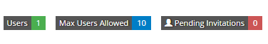

Personal Portal
^^^^^^^^^^^^^^^
All your personal content is accessible through your personal portal. Through this portal you can create new projects, manage your existing projects, quickly access your favourite projects and publications, create or your connectors, shop for connectors, and view and edit your personal details.

Create a New Project
^^^^^^^^^^^^^^^
In the ``Projects`` tabs on your Portal page you can find the button labeled ``Create New Project``. Clicking this button will allow you to create a new project by entering a Display Name, Description, and Scope. Once the project has been created you can then customize project information, add resources, add members, and follow changes that are occurring in that project. 

The ``Introduction`` page of each of your projects has a section to add summary text about your project. This section serves as an overview of your project. This is a good area to share information about your project with people that may be team members or viewing your project for the first time. 

Add a Resource
""""""""""""""""
On the Resources tab you can find all the Conformance and Example Resources for the project. 

If you have "Write" rights to a project you will see an option to ``+Add`` projects at the top of the Project Page. Here you can choose to upload a local file or fetch a resource from another FHIR server.

The following Upload options are available:

* You can upload **.json** or **.xml**
* You can upload a single **resource** or multiple in a **bundle**
* You can upload a **.zip** file containing multiple files

If you choose to add resources from a FHIR server, you can do a simple GET or a FHIR search. The first will add a single resource, the latter will let you add multiple resources at once. 

Examples:

- To add a Patient resource with id "example" : 
	``http://example.org/fhir/Patient/example`` 
- To add all Patient resources that conform to the DAF profile: 
	``http://example.org/fhir/Patient?profile=http://hl7.org/fhir/StringDefinition/daf-patient``

If you add a batch of resources (via a bundle, a zip, or a search query) you can choose how to publish the resources that are part of the batch.
The following options are available:

* Do not publish these resources automatically
* Publish these resources when their status is "Active" (examples will always be published)
* Publish all of them

*Add Resources to a Project Quickly*

You can now add bulk or single resources to your project using only the FHIRUrl for that resource. This fast option can be utilized via the “+Add” button in the top of your project page. Choose “Fetch from different source” from the drop down menu and fill the FHIRUrl for the resource or group of resources in that you would like to add.

Add Members
"""""""""""
The ``Members`` tab displays a list of all the members with rights to that project. In this section you can search for existing Simplifier members to add to your project by typing a user name in and clicking the ``+Add`` button. To invite non-Simplifier members to your project click on the ``Invite to Project`` option in the toolbar at the top of the Project page. This allows you to invite new members using their email address. An invitation is then sent to the user requesting that they create a Simplifier account to enable them access to your project.

While adding new members to your project you have the option to assign “Admin”, “Writer”, or “Reader” rights to that user. This assigns their rights within that particular project and can be changed at any time should someone’s function change. Users have the following rights within each role:

- **Admin**- Has the rights to change anything within the project with the exception of project ownership.
- **Writer**- Has the rights to add, change, and delete resources within the project.
- **Reader**- Has the rights to view anything within the project but cannot make any addtions or changes. 

Along the top of the ``Members`` tab you will find a summary of User information for your project. The number of users, the max users allowed for this project (in accordance with the type of plan you have), and the number of invitations you have pending (the number of users who have a not yet accepted an invitation).  

Track Project Changes
"""""""""""""""""""""
On the ``Log`` tab you will find event tracking for your project. This log keeps a list of all changes made to resources within your project, along with the name of the person that made changes and the time the changes were made. 

*Follow the progress of your projects*

You can now also follow the progress of projects that you have created or are a part of by clicking on the “Log” tab on the project’s page. Here you will see changes that have been made to a project by all project members. 

At the top of the screen you will find the Atom feed button. This allows you to subscribe to stay informed about any changes being made within your projects. To utilize this feature, navigate to a project on Simplifier.net that you are interested in following. Once there click on the “Subscribe” button in the upper right hand corner and copy the link into a feed reader of your choice. You are then ready to start receiving updates. 

.. image:: http://i1084.photobucket.com/albums/j404/askfj/c2818dc0-e545-4b80-9f44-47973f2ced94_zps0mgbkvyn.png
