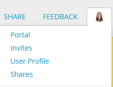
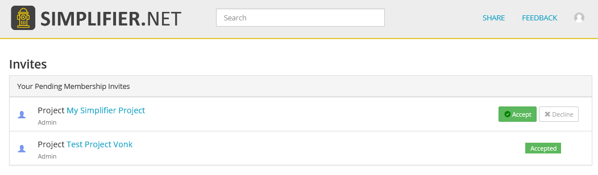
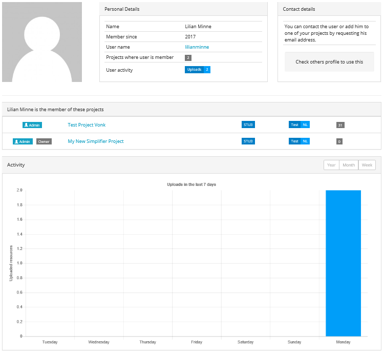
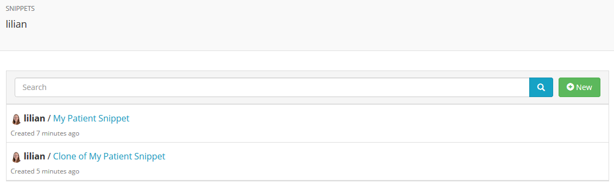
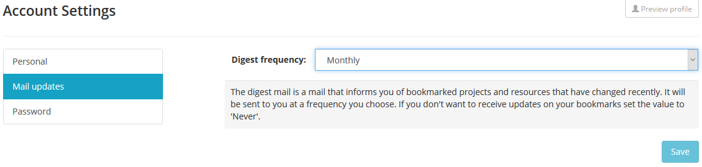

Users
^^^^^^^^^^^^^
Click on your avatar in the top right corner to access your personal menu. From here you can access your personal portal, invites page, user profile, snippets page, organization portal(s) and account settings.

Personal Portal
"""""""""""""""
All your personal content is accessible through your personal portal. The following tabs are available:

* **Projects**: On this tab you can `create new projects <simplifierProjects.html#create-a-project>`_ and/or manage your existing projects.
* **Bookmarks**: Use this tab to quickly access your favourite projects and publications. You can bookmark projects or resources by using the ``Bookmark`` button at the top right corner of the Project or Resource page. 
* **Connectors**: Here you can create and edit your `connectors <simplifierConnectors.html#connectors>`_ or shop for new connectors.
* **Organizations**: This tab shows an overview of the organizations you are part of. You can access your `organization portals <simplifierOrganizationPortal.html#organization-portal>`_ from here or create a new organization if you have the rights to do so.
* **Implementation guides**: In older versions of Simplifier, this was the place to `create and edit implementation guides <simplifierIGeditor.html#implementation-guide-editor>`_, but they are moved to projects. Old implementation guides that are not yet linked to a project can still be accessed here. If you want to have your guide moved to a project, please contact us by using the feedback button on the top right.

Invites Page
""""""""""""
On the invites page you see an overview of the projects that you were invited to. You can either accept or decline the invite.

User Profile
""""""""""""
This page shows your user profile as visible to other Simplifier users. It shows your personal details, user activity and a list of projects that you are member of. Other users that visit your profile may contact you by clicking the ``Contact User`` button on the right. This message will be sent to the email address that you provided during registration.

You can now add your usual social media handles, like Facebook, Twitter, LinkedIn etc. to your user profile. We provide this for users that want to have the option of having other users contact them about their work on Simplifier.

You can add these in your account settings, and you can view this directly from your own profile page. Your profile page can be found in the User Menu of your Portal dropdown.

Snippets
""""""""
Your Snippets page shows a list of all your personal `Snippets <simplifierResources.html#sharing-resources-with-snippet>`_. From here you can also make a new Snippet by clicking on the ``+New`` button on the right.

Account Settings
""""""""""""""""""""""""""""""""
Here you can edit your account settings. You can also visit your User Profile from this page by clicking on ``Profile`` in the upper right corner.

* **Avatar**: Upload an image and save it as your avatar. Your avatar will be visible in your user profile. 
* **Personal details**: Edit your personal details here: email, display name and a description, which will appear in your user profile. 
* **Mail updates**: Choose your settings for mail updates. The digest mail is a mail that informs you of bookmarked projects and resources that have changed recently. You can choose one of the following frequencies: daily, weekly, monthly or never. 
* **Change password**: This is where you can change your Simplifier password.
* **Social media**: Add social media like Twitter or LinkedIn. Your social media will appear in your user profile, so other Simplifier users can find you.
* **Licenses**: Lists your Simplifier licenses.
* **Features**: Shows which Simplifier features are active based on your account and license.

Reaching out to other users
"""""""""""""""""""""""""""
Would you like to collaborate with other users or reach out to users to ask question about their profiles? You can contact a user directly by having Simplifier send a mail to that user on your behalf. Just visit the Simplifier member's user page and click Contact User by Email. We will send your contact details along with a message so that the other user can respond to you directly by mail if they want to.
