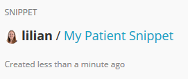
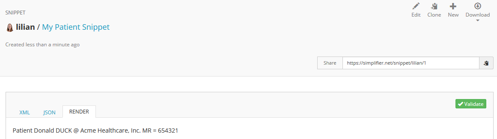

Resources
=========
Simplifier is a repository for FHIR resources. There are a multitude of resources that are available to the public including profiles, extensions, valuesets, dictionaries, mappings, examples and more.

Resource page
"""""""""""""
You can visit the page of a resource by selecting the resource from your search results or the ``Resources`` tab in your project, or following the direct link to the resource. While viewing resources you can display information in a few different ways.  

Depending on the type of resource, the different views include:

* **Overview** – This is either a preview (e.g. texts) or a Logical view (e.g. profiles) of the resource. The Logical view of a profile includes Element names in the leftmost column followed by Flags, Cardinality, Type, and  Description & Constraints.
* **Details** – This is an easy-to-read list per element of all the details of a profile. The specification refers to this as the dictionary.
* **Mappings** - This is a list of all the mappings specified in a profile.
* **Table** – This is a simple table view of the resource.
* **XML & JSON** – Respective views of resources in either XML or JSON formatting.
* **History** – On this tab you can view the difference between two versions of the same profile. This is a great feature for comparing and tracking changes.
* **Issues** - On this tab users with a paid account can track issues. New issues can be created by clicking the ``New issue`` button. The issue list can be filtered on open, closed or your own issues. By clicking on an issue you can read the entire conversation and add a new comment.

Update Resources
""""""""""""""""
When you want to update your resource, there are several ways to do so. Choose one of the following options from the ``Update`` menu at the top of the Resource page:

* **Upload**: Update by uploading a file (either XML or JSON)
* **Fetch**: Update by fetching from a different FHIR server (provide a GET request to the server where your resource is located)
* **Edit**: Update by editing the last version (opens a XML-editor in a small window where you can directly edit the XML code of your resource)
* **Editor**: Update by editing the last version (opens a stand-alone full screen XML-editor in a different tab where you can directly edit the XML code of your resource)

Download Resources
""""""""""""""""""
You may also choose to download the resource and save a local copy on your computer. You can either choose to download the resource as a XML or JSON file or directly copy the XML or JSON code of the resource to your clipboard, so you can easily copy-paste it to another location.

Add Resources
"""""""""""""
Go to your Project page to `add new resources <simplifierProjects.html#add-resources-to-your-project>`_ to your project.

Sharing resources with Snippet
""""""""""""""""""""""""""""""
The Snippet feature in Simplifier enables you to quickly share resources with another Simplifier user (e.g. for review purposes) without storing them in your project. Click on the ``Snippet`` button in the top right corner to use this feature.

.. image:: ./images/Snippet.PNG

Start by giving your Snippet a title, e.g. MyPatient. You can either upload a file or copy-paste your XML code in the editor. Select ``Add another file`` to upload more than one resource within the same Snippet. When you are finished uploading and editing your resources, click on the ``Create`` button on the right.

Your Snippet will now be available on Simplifier. The URL is displayed at the top right of the Snippet. You can quickly copy the URL to your clipboard by clicking on the ``Copy`` icon at the right.

When visiting the URL of a Snippet, you can choose to view either the XML code, JSON code or the rendered resource by selecting one of the available tabs. In the top right menu you can either select ``Edit`` to edit the resource, ``Clone`` to copy it in a new Snippet, ``New`` to create a new Snippet or ``Download`` to download the resource as a XML or JSON file. You can also validate the resource by using the green ``Validate`` button at the right.

Personal Snippets
-----------------
Through your  `personal menu <simplifierPersonalContent.html#users>`_ (click on your avatar at the top right and select ``Snippets``) you can access a list of all your Snippets. From here you can also quickly add a new Snippet by clicking the green ``+New`` button.

.. image:: ./images/MySnippets.PNG

Metadata Expressions
""""""""""""""""""""
The metadata expressions editor enables you to define what Simplifier should display as Title, Description, UrlKey, Workflow or FilePath for your resources. To start editing the metadata expressions of your project, select ``Settings`` and click on ``Metadata Expressions``.

When editing the metadata expressions you will have access to the default expressions used by Simplifier. If your FhirPath expressions are missing, are not correct or the value extracted is empty, Simplifier will fall back to the default expressions. If a default expression is not able to provide a value, a generic text based on the resource type will be used. Workflow and FilePath don't have a default expression. For FilePath in this case, if the extracted value is empty or missing, the fallback will be the original/generated filepath of the uploaded file.

As a convention, you must specify the resource type followed by the property (Title, Description, UrlKey, Workflow or FilePath) with a semicolon and the FhirPath expression based on which we extract the value.

.. tip::
  For more information on how to use FhirPath, visit the following link to the FhirPath specification: http://hl7.org/fhirpath/

Title and Description
---------------------
Using Title and Description in the expressions, you can influence how they are displayed in search results and on the resource page.

Example:

.. code-block:: Javascript

   Patient.Title: identifier
   Patient.Description: name.family

Note that in this example, identifier and name.family are both collections that could contain more than one item. By default Simplifier only takes the first item of a collection. We built a custom FhirPath function to concatenate multiple items called ``glue()``. The items are separated by the argument that is passed to this function.

Example:

.. code-block:: Javascript

   Patient.Description: name.family.glue(', ')

The description of the Patient resource will now show all family names of the patient, separated by a comma. It is also possible to take only the first name of the patient by adding ``[0]`` to the element. Another possibility is to merge collections from different elements by using the ``|`` character. So, to show the first given name and the first family name separated by a space, you would use:

.. code-block:: Javascript

   Patient.Description: (name[0].given[0] | name[0].family).glue(' ')

Note that the ``|`` character usually functions as an ``OR`` operator, as Simplifier will only select the first item in a collection. For example, say you want to show the name of an organization, but if name is empty you want to show the (first) identifier. You could use the following expression to do so:

.. code-block:: Javascript

       Organization.Title: name | identifier[0].value

In some cases, you may want to select the first item of a collection yourself. For example, when you want to add additional text as well. In this situation, you could also use the ``first()`` function that is available in FhirPath.

Example:

.. code-block:: Javascript

       PractitionerRole.Title: 'Role(s) of ' + (practitioner.display | practitioner.reference).first()

This example will show the value in the display element in the Reference to practitioner, if available. If not available, it will show the value in the reference element. If none of these values are available, Simplifier will fall back to the default value ``Example of a PractitionerRole`` that is defined in the core code.

There is a difference between using the ``+`` operator and the ``&`` operator to concatenate values. When the ``+`` operator is used and one of the values is empty, the complete result will be empty. When the ``&`` operator is used, it doesn't matter if any of the values are empty. The remaining values will still be concatenated. So, if we would have used the ``&`` operator instead of the ``+`` operator in the example above, and both practitioner.display and practitioner.reference are empty, Simplifier will show the Title of the PractitionerRole resource as follows: ``Role(s) of``, which is not what we wanted.

FilePath
--------

Special attention must be paid to the FilePath property. Since the filepath of the file is used for matching files in Simplifier, uniqueness is necessary. The extracted value for FilePath using the metadata expression must be unique within the project. Otherwise, a default fallback will be used or a new filepath will be generated.

.. warning::
   In case the project is linked to a Github repository and there is a FhirPath expression specified for FilePath in the metadata expressions screen, the resulting value must match the filepath of the file in Github. If the filepath doesn't match, the link is broken and the file will not be synced anymore.

Workflow
--------
The Workflow property is populated using a FhirPath expression for extracting a value from the extension of the resource. The extracted workflow key will be used to identify the corresponding workflow status from the custom workflow selected within the project in Simplifier.

Example:

.. code-block:: Javascript

   StructureDefinition.Workflow: extension(http://hl7.org/fhir/StructureDefinition/structuredefinition-fmm).value

Extras
------
When a property (Title, Description, UrlKey, Workflow or FilePath) should use the same FhirPath expression for all resource types, the generic Resource can be used.

Example:

   .. code-block:: Javascript

      Resource.FilePath: extension(http://organization.org/filepath-extension).value

The editor supports comments as well. Comments can be entered by using the ``#`` or ``//`` characters.

Example:

.. code-block:: Javascript

    #Resource examples
    Observation.Title: code.text
    //Profiles
    Profile.Description: <expression for your description>
    StructureDefinition.FilePath: <expression for filepath>
