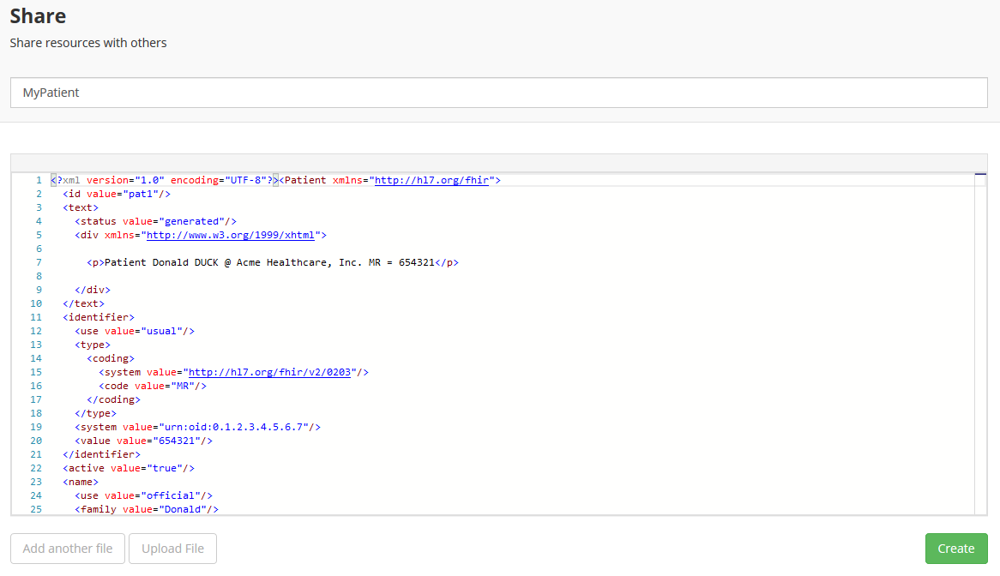
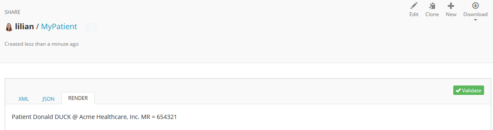
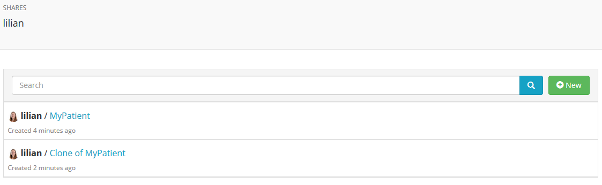

Share
^^^^^
The Share feature in Simplifier enables you to quickly share resources with another Simplifier user (e.g. for review purposes) without storing them in your project. Click on the ``Share`` button in the top right corner to use this feature.

Start by giving your Share a title, e.g. MyPatient. You can either upload a file or copy-paste your XML code in the editor. Select ``Add another file`` to upload more than one resource within the same Share. When you are finished uploading and editing your resources, click on the ``Create`` button on the right.

Your Share will now be available on Simplifier. You can copy the URL of your Share to your clipboard by hoovering your mouse over its title and clicking on the ``Copy`` icon that appears.

When visiting the URL of a Share, you can choose to view either the XML code, JSON code or the rendered resource by selecting one of the available tabs. In the top right menu you can either select ``Edit`` to edit the resource, ``Clone`` to copy it in a new Share, ``New`` to create a new Share or ``Download`` to download the resource as a XML or JSON file. You can also validate the resource by using the green ``Validate`` button at the right.

Personal Shares
"""""""""""""""
Through your personal menu (click on your avatar at the top right and select ``Shares``) you can access a list of all your Shares. From here you can also quickly add a new Share by clicking the green ``New`` button.

