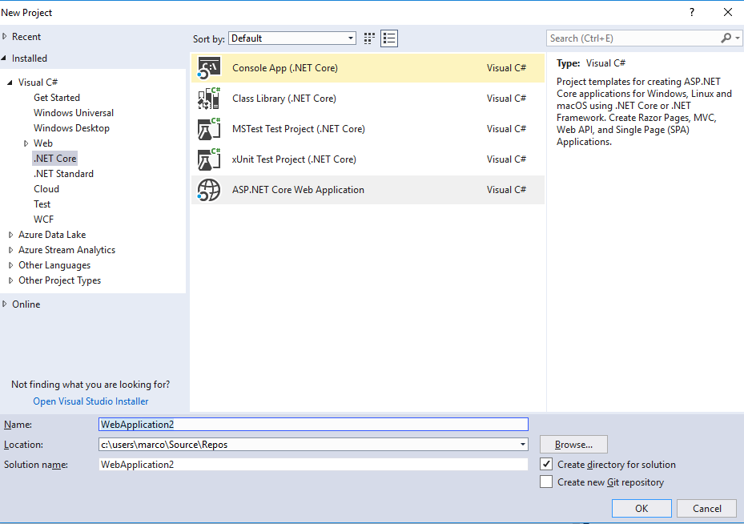
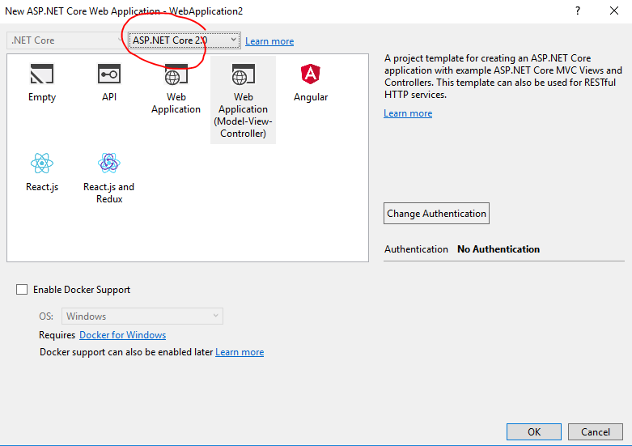
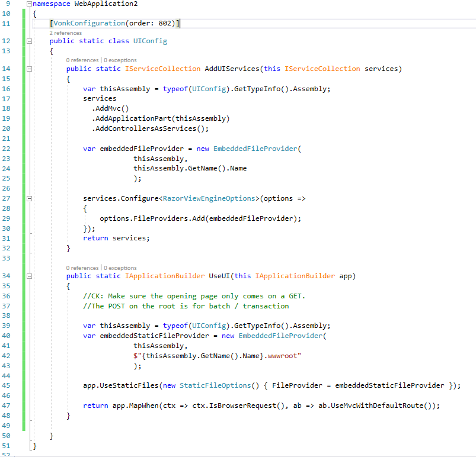

.. _vonk_components_landingpage:

Vonk FHIR Components example - new landing page
===============================================

As a minimal example of how to use Vonk FHIR Components we will show you how to create a library with your own landing page, and use it to replace the landing page that is provided by Vonk.

Create a new ASP.NET Core web application
-----------------------------------------

In Visual Studio create a new project of type ASP .NET Core Web Application:

Choose a name for your project and solution. Press OK to continue.

Choose ASP.NET Core 2.0 and select Web Application (Model-View-Controller). Press OK.

Add Vonk Package
----------------

Add Vonk.Core via the Nuget Package Manager:

.. image:: ../images/comp_landingpage_vonkpackage.png

This will give you access to all the core components of Vonk, including the ``Vonk.Core.Pluggability.VonkConfiguration`` attribute.

Adjust project file
-------------------

Add wwwroot and Views as an Embedded resource in the project file (that is neccessary for Vonk to pick them up from a library dll). 
To edit the project file, right click on the project file and select Edit <projectname>.cproj:

.. code-block:: xml

   <ItemGroup>
      <EmbeddedResource Include="wwwroot\**\*" />
      <EmbeddedResource Include="Views\**" />
   </ItemGroup>

And set Microsoft.AspNetCore.All to 2.0.0:

.. code-block:: xml
   
   <PackageReference Include="Microsoft.AspNetCore.All" Version="2.0.0" />

The project file will look like this:

.. code-block:: xml

   <Project Sdk="Microsoft.NET.Sdk.Web">

      <PropertyGroup>
         <TargetFramework>netcoreapp2.0</TargetFramework>
      </PropertyGroup>

      <ItemGroup>
         <PackageReference Include="Microsoft.AspNetCore.All" Version="2.0.0" />
         <PackageReference Include="Vonk.Core" Version="0.7.0-alpha843" />
      </ItemGroup>

      <ItemGroup>
         <DotNetCliToolReference Include="Microsoft.VisualStudio.Web.CodeGeneration.Tools" Version="2.0.4" />
      </ItemGroup>

      <ItemGroup>
         <EmbeddedResource Include="wwwroot\**\*" />
         <EmbeddedResource Include="Views\**" />
      </ItemGroup>

   </Project>

Save the project file.

Create the configuration class
------------------------------

Next, add a new file for the configuration class, as described in :ref:`vonk_components_configclass`. Annotate it with ``[VonkConfiguration(order: 802)]``. 
Then add the static methods as prescribed: 

.. code-block:: csharp

   public static IServiceCollection AddUIServices(IServiceCollection services)
   {
      var thisAssembly = typeof(UIConfiguration).GetTypeInfo().Assembly;
      services
         .AddMvc()
         .AddApplicationPart(thisAssembly)
         .AddControllersAsServices();

      var embeddedFileProvider = new EmbeddedFileProvider(
         thisAssembly,
         thisAssembly.GetName().Name
      );

      services.Configure<RazorViewEngineOptions>(options =>
      {
         options.FileProviders.Add(embeddedFileProvider);
      });
      return services;
   }

.. code-block:: csharp

   public static IApplicationBuilder UseUI(IApplicationBuilder app)
   {
      var thisAssembly = typeof(UIConfiguration).GetTypeInfo().Assembly;
      var embeddedStaticFileProvider = new EmbeddedFileProvider(
         thisAssembly,
         $"{thisAssembly.GetName().Name}.wwwroot"
      );

      app.UseStaticFiles(new StaticFileOptions() { FileProvider = embeddedStaticFileProvider });

      return app.MapWhen(ctx => ctx.IsBrowserRequest(), ab => ab.UseMvcWithDefaultRoute());
   }

The source file will then look like this:

Deploy and Configure
--------------------

Build this project in Release mode and copy the produced dll (located in <src>\\bin\\Release\\netcoreapp2.0) to the plugin directory of Vonk, as configured in the :ref:`PipelineOptions:PluginDirectory<vonk_components_config>`.

Go to the :ref:`configure_appsettings` of Vonk, and replace the namespace of the landingpage (``Vonk.DemoUI``) in the include of the PipelineOptions:

.. code-block:: JavaScript

   "PipelineOptions": {
      "PluginDirectory": "./plugins",
      "Branches": [
         {
            "Path": "/",
            "Include": [
               "Vonk.Core",
               "Vonk.Fhir.R3",
               "Vonk.Repository.Sql",
               "Vonk.Repository.MongoDb",
               "Vonk.Repository.Memory",
               "Vonk.Subscription",
               "WebApplication2" //This is the adjustment you make.
            ],
            "Exclude": [
            ]
         },
         {
            "Path": "/administration",
            "Include": [
               "Vonk.Core.Context",
               "Vonk.Core.Infra",
               "Vonk.Repository.Sql",
               "Vonk.Repository.MongoDb",
               "Vonk.Repository.Memory",
               "Vonk.Core.Operations.Terminology",
               "Vonk.Administration"
            ],
            "Exclude": [
            ]
         }
      ]
   }

Run and admire
--------------

Now run Vonk from the commandline or Powershell window with 

:: 

   	> dotnet .\Vonk.Server.dll

Open a browser and visit the homepage of Vonk (http://localhost:4080) to admire your own landingpage.

