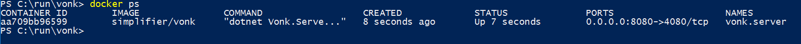
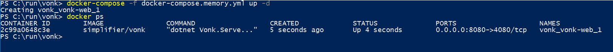

.. _use_docker:

====================
Using Vonk on Docker
====================

We have created a Docker image for Vonk, so you can run the server in any environment that supports Docker. For this section we
assume you have Docker installed on your system. If you want to install Docker for Windows, please read :ref:`docker_win` for specific
installation details.

.. _getting_started_docker:

Getting started
---------------

Before you can run Vonk, you will need to pull the Docker Vonk container and request a license.

1. Open your favourite command line tool and execute this command:
   ``> docker pull simplifier/vonk``

2. Go to the `Simplifier website <https://simplifier.net>`_, login and download your evaluation license.

3. Create a working directory for Vonk and place the license file there.

.. warning:: If you use Docker, you may want to run multiple instances of Vonk (e.g. with Kubernetes). Read :ref:`vonk_conformance_instances` for caveats with the Administration endpoint.

Running a Docker Vonk in SQLite mode
------------------------------------

The easiest and the default way to run a Docker Vonk container is to run Vonk in SQLite repository mode. Note that this is not the most performant mode - see MongoDB and SQL Server options below for that.

Open your command prompt and execute this command:
``> docker images simplifier/vonk``

You will get a list that looks like:

.. image:: ../images/docker1.png

Navigate to your working directory for Vonk and run the container with this command:

- in cmd.exe: ``docker run -d -p 8080:4080 --name vonk.server -v %CD%:/app/license -e "VONK_License:LicenseFile=./license/vonk-trial-license.json" simplifier/vonk``

- in Powershell: ``docker run -d -p 8080:4080 --name vonk.server -v ${PWD}:/app/license -e "VONK_License:LicenseFile=./license/vonk-trial-license.json" simplifier/vonk``

If your license file has a different name, use that name instead of ``vonk-trial-license`` in the command above.

.. important:: It looks like the command wants to retrieve your license file from a subdirectory called ``license``. This is a result
  of docker copying your file before spinning the image. You should **not** create the subdirectory. Just keep the license file in the root
  of your working directory.

This will spin up a Vonk container. It maps the host port 8080 to the container port 4080 with the switch ``-p 8080:4080``. It will give the
container the name vonk.server with the switch ``--name vonk.server``.
Furthermore it mounts the current directory (where the license file resides) from the host to the container. Also it passes an environment
variable ``VONK_License:LicenseFile`` to the container with the switch ``-e``.
In this example the license file is called vonk-trial-license.json. At last it will run the container in background mode with the switch ``-d``.

To test whether the container is running correctly, type the command:|br|
``> docker ps``

You can also take a look at the logs for Vonk with:|br|
``> docker logs vonk.server``

Open a browser and use the address ``http://localhost:8080/``. This will show the landing page of Vonk.

To stop the container just type:|br|
``> docker stop vonk.server``
|br| And to start it again:|br|
``> docker start vonk.server``
|br| To completely remove the container:|br|
``> docker rm vonk.server``

Spinning up with a docker-compose file
^^^^^^^^^^^^^^^^^^^^^^^^^^^^^^^^^^^^^^
Another way to spin up a Vonk container is to use a docker-compose file. The above example can also be established by the following ``docker-compose-sqlite.yml``:

.. code-block:: yaml
   :linenos:

   version: '3'

   services:

     vonk-web:
       image: simplifier/vonk
       ports:
         - "8080:4080"
       environment:
         - VONK_Repository=SQLite
         - VONK_Administration:Repository=SQLite
         - VONK_License:LicenseFile=./license/vonk-trial-license.json
       volumes:
         - .:/app/license

Save the text above to a file in your working directory with the name ``docker-compose.sqlite.yml`` and then run the following command: |br|
``> docker-compose -f docker-compose.sqlite.yml up -d``

If your license file has a different name, use that name instead of ``vonk-trial-license`` in the text above - but make sure to keep ``./license`` as that maps to a Docker volume inside the container.

To stop the container, run: |br|
``> docker-compose -f docker-compose.sqlite.yml down``

.. note::

    Strictly the settings for ``VONK_Repository`` and ``VONK_Administration`` are not needed here, since SQLite is the default setting. The settings are included to show where to configure the type of database to use.
    Much more information on that topic is in the paragraphs below.

Running Docker with a SQL Server container
------------------------------------------

Vonk can use also other repositories than Memory, for example SQL Server. This section describes how to spin up a Vonk container and a SQL Server container.
We will use docker-compose to achieve this.

.. warning:: SQL Server container uses at least 3.25 GB of RAM. Make sure to assign enough memory to the Docker VM if you're running on Docker for Mac or Windows.

.. warning:: If you also run the Administration database on SQL Server, please read :reF:`vonk_conformance_history`.

.. code-block:: yaml
   :linenos:

   version: '3'
   
   services:
     vonk-web:
       image: simplifier/vonk
       ports:
       - "8080:4080"
       depends_on:
         - vonk-sqlserver-db
       environment:
         - VONK_Repository=SQL
         - VONK_SqlDbOptions:ConnectionString=Initial Catalog=VonkStu3;Data Source=vonk-sqlserver-db,1433;User ID=sa;Password=SQLServerStrong(!)Password*
         - VONK_SqlDbOptions:SchemaName=vonk
         - VONK_SqlDbOptions:AutoUpdateDatabase=true
         - VONK_SqlDbOptions:AutoUpdateConnectionString=Initial Catalog=VonkStu3;Data Source=vonk-sqlserver-db,1433;User ID=sa;Password=SQLServerStrong(!)Password*
         - VONK_Administration:Repository=SQL
         - VONK_Administration:SqlDbOptions:ConnectionString=Initial Catalog=VonkAdmin;Data Source=vonk-sqlserver-db,1433;User ID=sa;Password=SQLServerStrong(!)Password*
         - VONK_Administration:SqlDbOptions:SchemaName=vonkadmin
         - VONK_Administration:SqlDbOptions:AutoUpdateDatabase=true
         - VONK_Administration:SqlDbOptions:AutoUpdateConnectionString=Initial Catalog=VonkAdmin;Data Source=vonk-sqlserver-db,1433;User ID=sa;Password=SQLServerStrong(!)Password*
         - VONK_License:LicenseFile=./license/vonk-trial-license.json
       volumes:
         - .:/app/license
   
     vonk-sqlserver-db:
       image: microsoft/mssql-server-linux
       ports:
         - "1433:1433"
       environment:
         - ACCEPT_EULA=Y
         - SA_PASSWORD=SQLServerStrong(!)Password*
       healthcheck:
         test: /opt/mssql-tools/bin/sqlcmd -S localhost -U sa -P 'SQLServerStrong(!)Password*' -Q 'SELECT 1 FROM VonkSTU3.sys.tables'
         interval: 1m30s
         timeout: 10s
         retries: 3
   
Save the text above to a file in your working directory with the name ``docker-compose.mssqlserver.yml``. Make sure your Vonk license file is named
``vonk-trial-license.json`` and is residing in your working directory (see :ref:`getting_started_docker` on how to obtain the license). 
If your license file has a different name, use that name instead of ``vonk-trial-license`` in the text above.

Then use this command to spin up a Vonk container and SQL container: |br|
``> docker-compose -f docker-compose.mssqlserver.yml up -d``

Open a browser and use the address ``http://localhost:8080/``. This will show the landing page of Vonk.

.. warning:: Wait for about 2 minutes, because it takes a while to fire up the SQL container

Running Docker with a SQL Server on host
----------------------------------------

Another possibility is to run a Vonk container with a SQL Server repository on the host. You will need a Microsoft SQL Server running on your host.
The version of SQL Server must at least be version 2012.

.. warning:: If you also run the Administration database on SQL Server, please read :reF:`vonk_conformance_history`.

To run the Vonk container we will use the following docker-compose file:

.. code-block:: yaml
   :linenos:

   version: '3'

   services:
 
     vonk-web:
       image: simplifier/vonk
       ports:
         - "8080:4080"
       environment:
         - VONK_Repository=SQL
         - VONK_SqlDbOptions:ConnectionString=Database=VonkStu3;Server=my_host\<myInstanceName>;User ID=<myUser>;Password=<myPassword>
         - VONK_SqlDbOptions:SchemaName=vonk
         - VONK_SqlDbOptions:AutoUpdateDatabase=true
         - VONK_SqlDbOptions:AutoUpdateConnectionString=Database=VonkStu3;Server=my_host\<myInstanceName>;User ID=<DLLUser>;Password=<myPassword>
         - VONK_Administration:Repository=SQL
         - VONK_Administration:SqlDbOptions:ConnectionString=Database=VonkAdmin;Server=my_host\<myInstanceName>;User ID=<myUser>;Password=<myPassword>
         - VONK_Administration:SqlDbOptions:SchemaName=vonkadmin
         - VONK_Administration:SqlDbOptions:AutoUpdateDatabase=true
         - VONK_Administration:SqlDbOptions:AutoUpdateConnectionString=Database=VonkAdmin;Server=my_host\<myInstanceName>;User ID=<DLLUser>;Password=<myPassword>
         - VONK_License:LicenseFile=./license/vonk-trial-license.json
       volumes:
         - .:/app/license
       extra_hosts:
         - "my_host:192.0.2.1"
 
Save the text above to a file in your working directory with the name ``docker-compose.mssqlserver_host.yml``. Before we spin up the container we have
to adjust the ``docker-compose.mssqlserver_host.yml``:

* On lines 11, 14, 16 and 19 the connection string to the database server is stated. Change the ``Server`` to your database server and instance name.
* Also change the ``User ID`` and ``Password`` on lines 11, 14, 16 and 19 to your credentials.
* Furthermore we have to tell Docker which IP address the host uses. This is done on line 24.
  In this case the host (named my_host) uses IP address 192.0.2.1. Change this to the appropriate address.

After saving your settings, make sure your Vonk license file is named ``vonk-trial-license.json`` and is residing in your working directory
(see :ref:`getting_started_docker` on how to obtain the license). Or use the name of your license file instead of ``vonk-trial-license`` in the text above.

You can run the Vonk container as follows: |br|
``> docker-compose -f docker-compose.mssqlserver_host.yml up -d``

A database will automatically be created if is not already present on the database server. See :ref:`this page <overview_of_permissions>` for an overview of permissions the database user needs for creating the database and/or schema.

Open a browser and use the address http://localhost:8080/. This will show the landing page of Vonk.

.. warning:: When you have a firewall installed on your host machine, it can block traffic from your Vonk container to your host.
	Provide an inbound rule to allow traffic from the container to the host.

Run Docker with a MongoDB container
-----------------------------------

This section describes how to spin up a Vonk container and a MongoDB container using a docker-compose. We assume you already have MongoDB installed.

.. warning:: If you also run the Administration database on MongoDb, please read :reF:`vonk_conformance_history`.

.. code-block:: yaml
   :linenos:

   version: '3'
	 
   services:
	 
     vonk-web:
       image: simplifier/vonk
       environment:
         - VONK_Repository=MongoDb
         - VONK_MongoDbOptions:ConnectionString=mongodb://vonk-mongo-db/vonkstu3
         - VONK_MongoDbOptions:EntryCollection=vonkentries
         - VONK_Administration:Repository=MongoDb
         - VONK_Administration:MongoDbOptions:ConnectionString=mongodb://vonk-mongo-db/vonkadmin
         - VONK_Administration:MongoDbOptions:EntryCollection=vonkentries
         - VONK_License:LicenseFile=./license/vonk-trial-license.json
       volumes:
         - .:/app/license
       ports:
         - "8080:4080"
	 
     vonk-mongo-db:
       image: mongo

Save the text above to a file in your working directory with the name ``docker-compose.mongodb.yml``. Make sure your Vonk license file is named ``vonk-trial-license.json``
and is residing in your working directory (see :ref:`getting_started_docker` on how to obtain the license).
If your license file has a different name, use that name instead of ``vonk-trial-license`` in the text above.

Use this command to spin up a Vonk container and MongoDB container: |br|
``> docker-compose -f docker-compose.mongodb.yml up -d``

Open a browser and use the address http://localhost:8080/. This will show the landing page of Vonk.

.. |br| raw:: html

    
