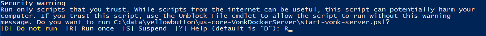

.. _yellowbutton:

================================================
Yellow Button - Vonk for your Simplifier project
================================================

Yellow Button is an easy way to run an instance of Vonk FHIR Server that is aware of all the profiles, search parameters and other (conformance) resources that are part of a Simplifier project. That can be a project of your own or for instance a project with national profiles.

Prerequisites
-------------

Yellow Button provides you with a PowerShell script to start Vonk FHIR Server in a Docker container. This means that you will need:

- Windows OS that can run Docker for Windows
- Docker for Windows

If you still need to install Docker for Windows, please read :ref:`docker_win` for specific installation details.

Getting the server
------------------

Go to `Simplifier`_ and open the project page of the project that has the profiles that are relevant to you. For our example we took the US-Core project. Note that is has to be an *STU3* project.

On the project page, click the Download button, and in the dropdown menu that appears, click 'US-Core FHIR Server' (the name here will reflect the name of the project). It is shown in the image below with the menu item marked in yellow. The light blue marking shows you where to check whether this is a FHIR STU3 project.

.. image:: ../images/yellow_SimplifierDownload.PNG
  :align: left

When you click the menu item, Simplifier takes you to a page with instructions. It also includes a link to this documentation page, since we can host more detailed instructions here than on the Simplifier site.

.. image:: ../images/yellow_SimplifierInstructions.PNG
  :align: left

Click the yellow / orange Download button and you will download a zip file named after the server you are installing. Here it is ``us-core-VonkDockerServer.zip``. Save it and unpack it in a folder on your harddrive. I unpacked it to ``c:\data\yellowbutton\us-core-VonkDockerServer``.

.. image:: ../images/yellow_ZipExtract.PNG
  :align: left

Running the server
------------------

Open Windows Powershell (or Windows Powershell ISE if you prefer). Windows Powershell by default does not allow you to run scripts that you downloaded from the internet. To make sure you allow the server script to run, first tell Powershell that that is all right::

    > Set-ExecutionPolicy Unrestricted -Scope CurrentUser

You can be more restrictive by setting it to ``RemoteSigned``. See `Documentation on ExecutionPolicy`_ for more background.

Now go to the folder where you unpacked the zip, and run the script ./start-vonk-server.ps1::

    > cd c:\data\yellowbutton\us-core-VonkDockerServer
    > .\start-vonk-server.ps1

Powershell will probably still ask for confirmation before running the script. Type 'R' to allow it to run:

The script will pull images from the Docker hub as necessary, and then start the Vonk FHIR Server. Vonk will load all the conformance resources from the core specification, and from your project into its Administration database. You can read :ref:`conformance` if you want to know more about this. Since this may take some time, you will see a progress bar. Vonk is allowed to finish this task in at most 6 minutes.

.. image:: ../images/yellow_ScriptProgress.PNG
  :align: left

As soon as Vonk is ready, the script will finish and it will open your browser on the endpoint of Vonk: http://127.0.0.1:8080/, showing the landing page. For further use of the Vonk RESTful API you will want to use an API testing tool like Postman.

If the script does not finish in due time, please check the Common errors and mistakes below.

Common errors and mistakes
--------------------------

Error messages
^^^^^^^^^^^^^^

1. Docker is not running
    ::

        error during connect: Get http://%2F%2F.%2Fpipe%2Fdocker_engine/v1.39/containers/json: open //./pipe/docker_engine: The system cannot find the file specified. 
        In the default daemon configuration on Windows, the docker client must be run elevated to connect. This error may also indicate that the docker daemon is not running.
        Docker is not running, now exiting the script. See https://docs.docker.com/docker-for-windows/install/ for more information.

    Solution: The problem is exactly as stated -- your Docker for Windows is probably not running. Start it from the Windows Start menu and try again.

2. Mount failed
    ::

        ERROR: for vonk-web  Cannot start service vonk-web: error while creating mount source path '/host_mnt/c/data/yellowbutton/us-core-VonkDockerServer/license': mkdir /host_mnt/c: file exists

    .. image:: ../images/yellow_DockerMountError.png

    Solution: This may happen at subsequent starts of the Vonk container. It appears to be an error in Docker for Windows. But it may be fixed by resetting the credentials for Drive Sharing in Docker for Windows (even if you did not change your password). See :ref:`docker_win_shared_drives` for more information.

3. Network failed
    ::

        ERROR: for vonk-web  Cannot start service vonk-web: driver failed programming external connectivity on endpoint ...

    .. image:: ../images/yellow_PortmappingError.png

    Solution: This is an issue reported as `Issue 1967 on Docker for Windows`_. It can be solved by restarting Docker on Windows. 

Configuration checks
^^^^^^^^^^^^^^^^^^^^

1. Is Docker for Windows configured to run *Linux* containers and not Windows containers? Check the `Docker switching Container type`_ documentation on this if needed.
2. Did you enable Shared Drives on Docker for Windows? Yellow Button needs this to provide the license file to the Docker container. See :ref:`docker_win_shared_drives` for more information.
3. Did you change your Windows password after sharing your drive in Docker for Windows? If so, you need to reset your credentials in Docker for Windows. See :ref:`docker_win_shared_drives` for more information.
4. Does Docker for Windows have enough resources to let Vonk run its initialization within the designated time? You can give it more resources in the `Docker Advanced Settings`_.

Still no luck? Please contact us on vonk@fire.ly. Please include:

- the output of the Powershell script ./start-vonk-server.ps1
- version info of Windows
- version info of Docker for Windows
- any other information you think is relevant.

Using the server
----------------

When your Vonk server is running, you can check whether your profiles are indeed present in the server by requesting them from the Administration endpoint. In this example we search for the US-Core profiles::

    GET http://127.0.0.1:8080/administration/StructureDefinition?url:below=http://hl7.org/fhir/us/core

Please note that any Conformance resources that influence the behaviour of Vonk -- such as the Validation -- must be managed on the Administration API and not the regular FHIR endpoint. See :ref:`administration_api` for more background.

If the project you created the server off of contains any *example* resources, they will be available at the normal FHIR endpoint::

    GET http://127.0.0.1:8080/<more specific search if you want>

Your project in progress
------------------------

You created the Vonk FHIR Server off of a Simplifier project. That project may evolve. Either because it is your own and you improve your profiles, or because the maintainer of the project applies changes. Vonk is connected to the Simplifier project. This means that you can update the conformance resource in Vonk from the contents of the project by:

- invoking importResources::

    POST http://127.0.0.1:8080/administration/importResources

- or restarting Vonk::

    > ./stop-vonk-server.ps1
    > ./start-vonk-server.ps1

Further steps
-------------

Yellow Button is an easy way to get started with Vonk FHIR Server. But there are many other :ref:`deployment` options for the server. Besides that you can add your own plugins with :ref:`vonk_components`, or build a :ref:`vonk_facade` with Vonk. 

.. _Simplifier: https://simplifier.net

.. _Docker switching Container type: https://docs.docker.com/docker-for-windows/#switch-between-windows-and-linux-containers

.. _Docker Advanced Settings: https://docs.docker.com/docker-for-windows/#advanced

.. _Documentation on ExecutionPolicy: http://go.microsoft.com/fwlink/?LinkID=135170

.. _Issue 1967 on Docker for Windows: https://github.com/docker/for-win/issues/1967
