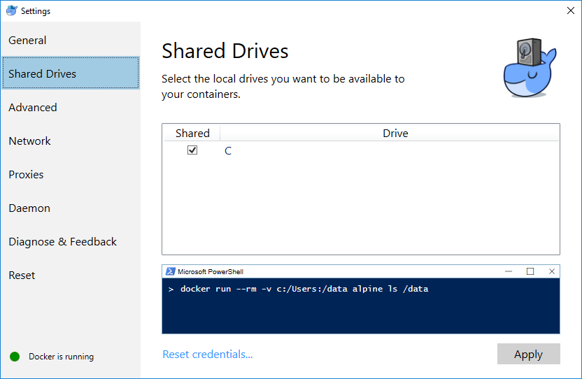
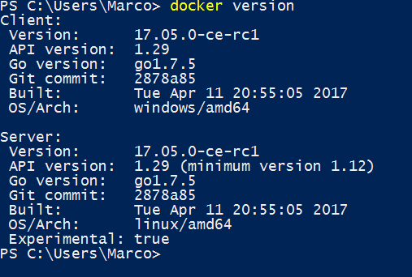
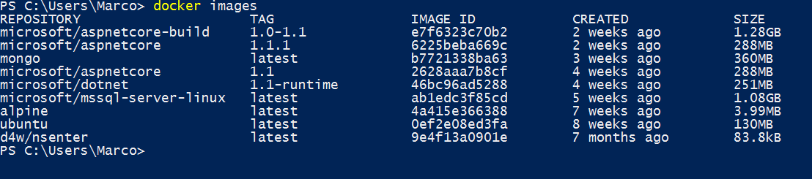

.. _docker_win:

=============================
Installing Docker For Windows
=============================

To install Docker For Windows, look at `the official Docker pages <https://docs.docker.com/docker-for-windows/install>`_ and please make sure you install
the Edge channel.

After installing, make sure that Shared Drives has been enabled.
To do this, open the settings for Docker for Windows and navigate to Shared Drives. Tick the drive you want to share and apply your settings:

More information about sharing drives can be found `here <https://docs.docker.com/docker-for-windows/#shared-drives>`_. 

To test the installation, open your favorite command line tool and type the following command:

``> docker version``

This will result in the following:

  
To show which images are located on your machine, type:
 
``> docker images``
 

 
This example shows you a number of images. When you have just installed Docker For Windows, you probably won't have any images located on your machine.