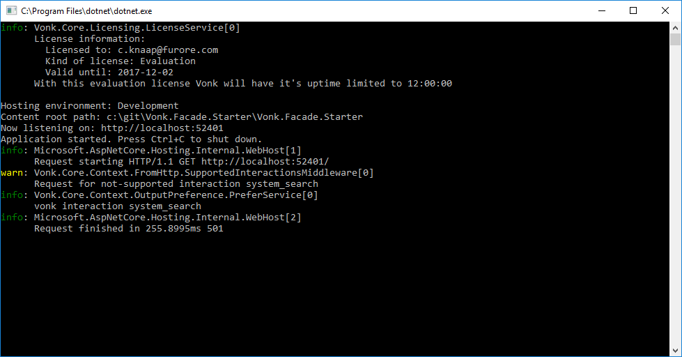

.. _project_setup:

Starting your project
=====================

In this step, you will create and setup your project to start building the facade. At the end of the page, you will
find a link to an example result of these steps.

Create new project
------------------

#. Open Visual Studio 2017
#. File | New | Project

   * ASP.NET Core Web Application
   * Project name and directory at your liking; Next
   * .Net Core; ASP.NET Core 2.0

        .. image:: ./images/NewProject-1.PNG
            :align: center
#. Run your project with F5, and check whether it starts, an on what port.

Adjust how your project is run
------------------------------

#. Visual Studio loads the 'homepage' into your default browser when you start the project. Since that is not exactly useful for a FHIR RESTful server, you may disable this from the Project Properties:

.. image:: ./images/PreventBrowserLaunch.PNG
   :align: center

#. In this same window, alter the App URL to http://localhost:5017
   You can choose another port number, but this one is used throughout the text.

#. Visual Studio by default runs your application inside IIS Express. You can change it to run the ASP.NET Core Kestrel webserver directly by changing the value next to the green run button in the toolbar from 'IIS Express' to the name of your project.
   See the highlight in the above image.

Add Configuration
-----------------

Vonk needs configuration settings, and maybe you do to. For ASP.NET Core projects settings are usually in the file appsettings.json. We will add this file and make it available to Vonk.

#. Create a settings file (see :ref:`configure_appsettings` for more background)

   * File | New | ASP.NET Configuration File
   * Accept the default name appsettings.json
   
   
   Visual Studio opens the newly created appsettings file.

   * Remove the default ConnectionStrings section, but keep the outermost curly brackets
   * Add the reference to your license file: ``"LicenseFile": "c:/vonk/vonk-trial-license"``
   * Add the ``SupportedInteractions`` section. Look into :ref:`configure_appsettings` to check what this section should contain. 
     For now you only need ``"WholeSystemInteractions": "capabilities"``, but you may already add ``read`` and ``search`` also for convenience. 
#. Open Program.cs

   * Adjust the building of the WebHost to enable more detailed logging and reading the appsettings::

        public static IWebHost BuildWebHost(string[] args) =>
            WebHost.CreateDefaultBuilder(args)
             .ConfigureLogging((hostingContext, logging) =>
             {
                 logging.SetMinimumLevel(LogLevel.Trace);
             })
            .ConfigureAppConfiguration((hostContext, config) =>
            {
                var hostingEnv = hostContext.HostingEnvironment;
                config.Sources.Clear(); // Clear default sources

                config
                    .SetBasePath(hostContext.HostingEnvironment.ContentRootPath)
                    .AddJsonFile(path: "appsettings.json", reloadOnChange: true, optional: true)
                    .AddJsonFile(path: "appsettings.instance.json", reloadOnChange: true, optional: true); //Load instance specific settings. This file is intentionally not included in the Git repository.
            })
            .UseStartup<Startup>()
                .Build(); 

Add Vonk Components
-------------------

1. Tools > NuGet Package Manager > Package Manager Console

   * Run ``Install-Package Vonk.Core -IncludePrerelease``
   * Run ``Install-Package Vonk.Fhir.R3 -IncludePrerelease``

2. Open Startup.cs

   * In the method ConfigureServices register the services needed for a minimal FHIR Server::

        services
            .AddFhirServices()
            .AddVonkMinimalServices()
        ;

   * Apply the usings that Visual Studio suggests.

   * In the method Configure, before the App.Run statement add::
   
        app
            .UseVonkMinimal()
        ;

   * Then remove the App.Run statement.

Now you can run the project again, it should start without errors, and the log should look like this:

To test if the server is running correctly, open Postman, or Fiddler, or use curl to request ``http://localhost:5017/metadata``

If you get a CapabilityStatement as a result, you now officially have a FHIR Server running!

You can get the result of the exercise of this step in the Github branch exercise/step2::

    git checkout exercise/step2
