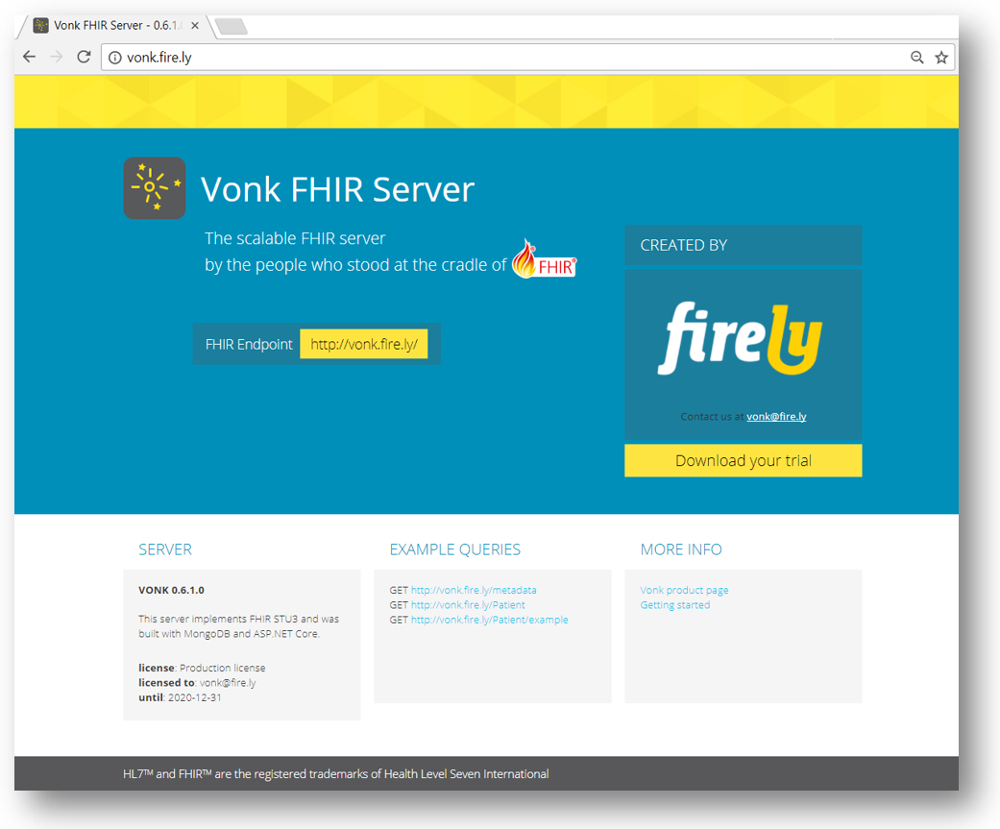

.. _vonk_index:

Welcome to the Vonk server documentation
=========================================

.. toctree::
   :maxdepth: 1
   :titlesonly:
   :hidden:

   Overview <overview>
   Getting started <getting_started>
   Release notes <releasenotes/releasenotes>
   How to upgrade <releasenotes/upgrade>
   Roadmap <releasenotes/roadmap>
   FAQ <faq>
   Configuration <configuration/configuration>
   Deployment <deployment/deployment>
   Features <features/features>
   Administration API <administration_api>
   Plugins <plugins/plugins>
   Facade <facade/facade>
   Reference <reference/reference>
   contact
.. add files here

`Vonk <https://fire.ly/products/vonk/>`_ is Firely's FHIR server and the successor to our Spark server.

Vonk is the answer to the growing need for a stable server that can be used in a variety of production environments.
A public sandbox is available at https://vonk.fire.ly, which is is free to use and intended for
testing and educational purposes only.

On these pages we provide you with the documentation you need to get up and running with your own standard Vonk
installation, as well as information on how to contact us when you have additional needs, such as a custom implementation
or support contract.

