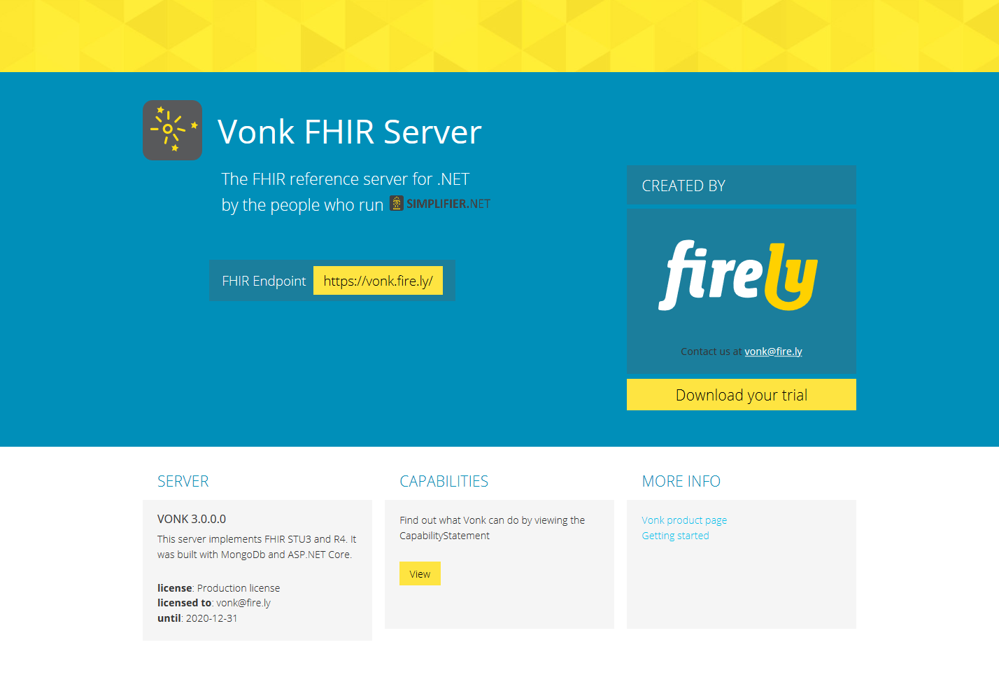

.. _vonk_index:

Welcome to the Vonk server documentation
=========================================

`Vonk <https://fire.ly/products/vonk/>`_ is Firely's FHIR server and the successor to our Spark server.

.. The Spark server was intended to be
   a proof of concept implementation to test the HL7 FHIR specification and support the community during connectathons.
   Spark was not designed and built for production and as such is not easily adaptable to every situation.

Vonk is the answer to the growing need for a stable server that can be used in a variety of production environments.
A public sandbox is available at https://vonk.fire.ly. This edition is free to use and intended for
testing and educational purposes only.

On these pages we provide you with the documentation you need to get up and running with your own standard Vonk
installation, as well as information on how to contact us when you have additional needs, such as a custom implementation
or support contract.

.. toctree::
   :maxdepth: 1
   :titlesonly:
   :hidden:

   start
   configuration/configuration
   deployment/deployment
   features/features
   administration_api
   facade/facade
   components/components
   architecture
   releasenotes/releasenotes
   releasenotes/releasenotes_old
   contact
.. add files here
