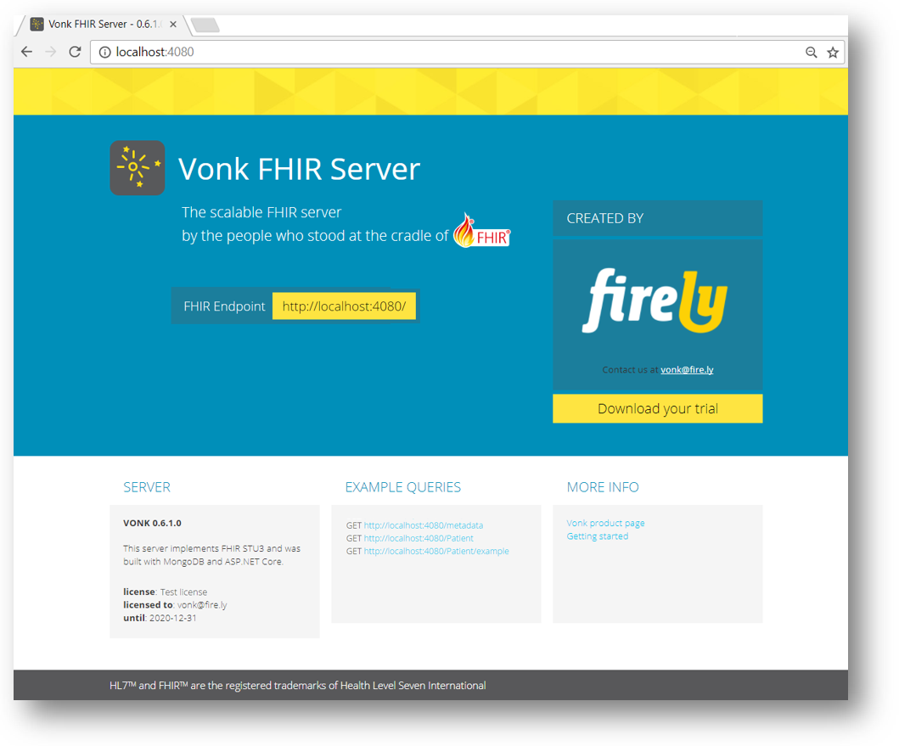

.. _getting-started:

===============
Getting Started
===============

If you want to start using the standard Vonk server in your own Windows environment, follow the steps on this page to install
and run the server. |br|
For non Windows systems, or if you want to use Docker for Windows, please look at the :ref:`use_docker` section.

1.	Download the Vonk binaries and the license file from `Simplifier.net <https://simplifier.net/vonk>`_.
	
2.	Extract the downloaded files to a location on your system, for example: :code:`C:\Vonk`. We will call this the 
	working directory.

3.	Put the license file in the	``\bin`` subdirectory under the working directory.

4.	Open ``\bin\appsettings.json`` and change the ``LicenseFile`` property to the name of your license file. For example::

	"LicenseFile": "vonk-trial-license.json",

.. important:: the next step assumes you have a .Net Core environment installed. If not, please `download and install
  <https://www.microsoft.com/net/download/core>`_ it before you continue.

5.	Open a command prompt or Powershell, navigate to the ``bin`` directory and run:
	:code:`> dotnet .\Vonk.Server.dll`

	Vonk will then run on port 4080 of the system.
	
6.	If you want to check if Vonk is running correctly, open a browser and go to :code:`localhost:4080`.
	You should see a homepage similar to this:
   

Please note that the third example query ``/Patient/example`` will only work if you first PUT a Patient with the id 'example'.
You can get this `example from the specification <http://www.hl7.org/implement/standards/fhir/patient-example.json>`_.

The :ref:`next section <configure>` explains how you can configure the Vonk server.

.. |br| raw:: html

    
